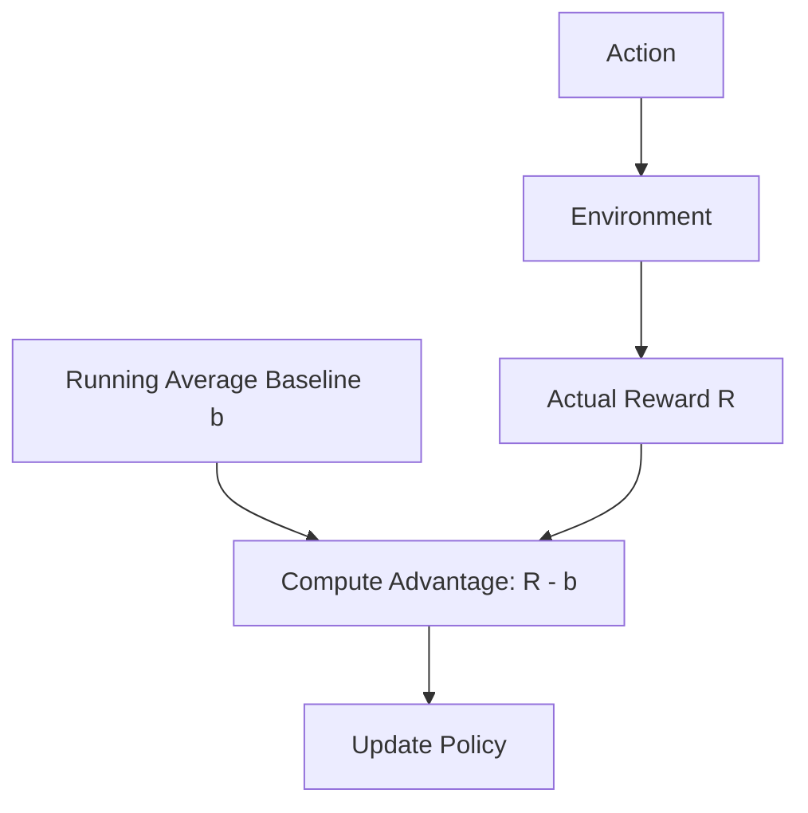

# REINFORCE with Baseline

🧠 **What does this do? (The Analogy)**
Think of a **Stand-up Comedian**. Standard REINFORCE is like a comedian who tells a joke and waits for the audience to laugh. If they laugh, the comedian tells the joke again. If they don't, the comedian stops. However, if the audience is *always* happy, the comedian doesn't know which jokes are truly great. **REINFORCE with Baseline** is like having a "Laughter Meter" that tracks the **average laugh**. The comedian only focuses on jokes that got a **bigger laugh than average**.

🔍 **Step-by-Step Explanation:**
1. **The Policy Gradient**: We update the policy weights by multiplying the log-probability of an action by the reward.
2. **The Problem (High Variance)**: Rewards can be huge and inconsistent, making the updates very "jumpy."
3. **The Baseline ($b$)**: We subtract an average reward (baseline) from the actual reward.
4. **Advantage**: The update becomes $\nabla \log \pi(a|s) \cdot (R - b)$. This ensures that we only reinforce actions that are "better than usual."

📊 **High-Level Design (HLD)**

✅ **Why use this?**
It is the most basic way to make Policy Gradient algorithms stable. It is the direct ancestor of modern algorithms like PPO and A3C.

🌍 **Real-World Examples:**
1. **A/B Testing Optimization**: An AI that learns which website layout converts better than the current "average" baseline layout.
2. **Game Difficulty Adjustment**: An AI that learns to adjust game difficulty only when the player's engagement is significantly "above or below" their historical average.
