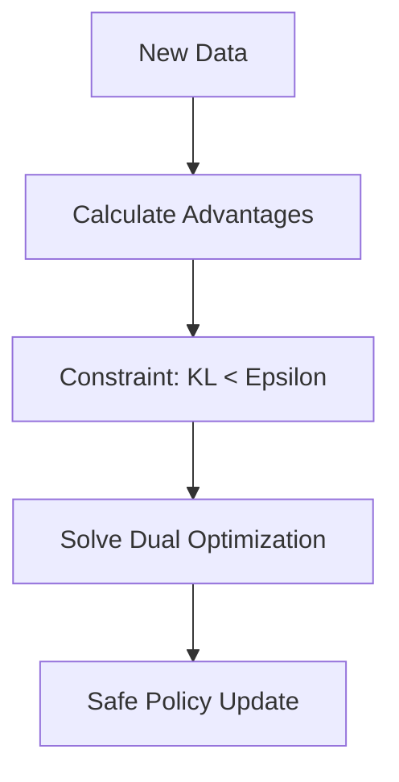

# REPS (Relative Entropy Policy Search)

🧠 **What does this do? (The Analogy)**
Think of a **Careful Librarian**. You want to reorganize the books to make them easier to find (Policy Update). But the Librarian warns: "If you move the books too much, everyone will get confused and no one will find anything!" **REPS** is a rule that says: "You can move the books, but the **Total Change** in where the books are must be very small." It ensures the AI doesn't "forget" how to act while it's trying to get better.

🔍 **Step-by-Step Explanation:**
1. **KL-Divergence Constraint**: Like TRPO, REPS limits how much the policy can change in one step.
2. **Information Loss**: It specifically focuses on minimizing the "Information Loss" between the old policy and the new one.
3. **Dual Optimization**: It solves a mathematical "Dual" problem to find the optimal temperature ($\eta$) that balances reward and safety.
4. **Benefit**: It is one of the most stable algorithms for **Robotics** because it guarantees that the robot will never suddenly try a "crazy" new movement that could break its motors.

📊 **High-Level Design (HLD)**

✅ **Why use this?**
It is the "Safe Choice" for real-world mechanical systems. While PPO and TRPO are more famous, REPS is often preferred in research labs for high-precision robotic tasks where safety is the #1 priority.

🌍 **Real-World Examples:**
1. **Precision Surgery Robots**: Ensuring the robotic arm never makes a "radical" change in movement while learning a new procedure.
2. **Wind Turbine Control**: Adjusting the blade angles to maximize energy while strictly ensuring the mechanical stress doesn't exceed a safe limit.
