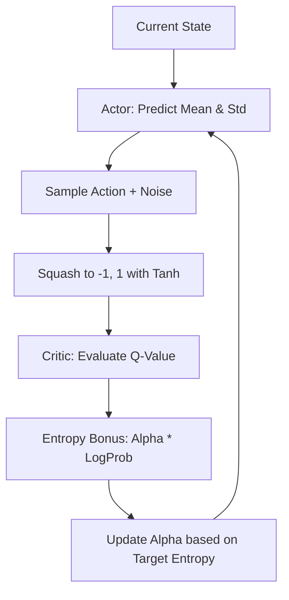

# SAC (Soft Actor-Critic) with Auto-Alpha

🧠 **What does this do? (The Big Picture)**
Think of a **Professional Explorer** who gets a bonus for being "Curious." If the explorer is too scared (low entropy), they only walk the same safe path. If they are too crazy (high entropy), they waste energy jumping off cliffs. **SAC with Auto-Alpha** is an AI that **manages its own curiosity level**. It automatically turns its "Curiosity" (Alpha) up when the world is mysterious and turns it down when it has found a perfect, stable path.

🔍 **The Maximum Entropy Objective:**

1.  **The Formula**: $J(\pi) = \sum \mathbb{E} [r(s,a) + \alpha \mathcal{H}(\pi(\cdot|s))]$.
    - It maximizes the Reward PLUS the randomness (Entropy).
2.  **Reparameterization Trick**: Instead of picking a random action, the AI outputs a "Mean" and a "Standard Deviation." It then samples a "Noise" and calculates: $\text{Action} = \text{Mean} + \text{Std} \cdot \text{Noise}$.
3.  **Automatic Tuning**: We don't guess the value of Alpha. We tell the AI: "Try to keep your entropy at -2.0." The AI then uses math to adjust Alpha until its "Curiosity" matches that target.

📊 **High-Level Design (HLD)**

✅ **Why use this?**
SAC is widely considered the **most efficient algorithm for continuous control** (like robotics). It is much more stable than DDPG because the "Entropy Bonus" prevents the AI from getting stuck in a single bad idea. The "Auto-Alpha" version removes the need for humans to spend days tuning the curiosity settings.

🌍 **Real-World Examples:**
1. **Legged Robots (Boston Dynamics style)**: Learning to walk on slippery ice by staying "Curious" about different foot placements until it finds a stable rhythm.
2. **Autonomous Chemical Synthesis**: Exploring different temperature and pressure combinations to find a new medicine, while ensuring it doesn't just stick to the first "okay" recipe it finds.
