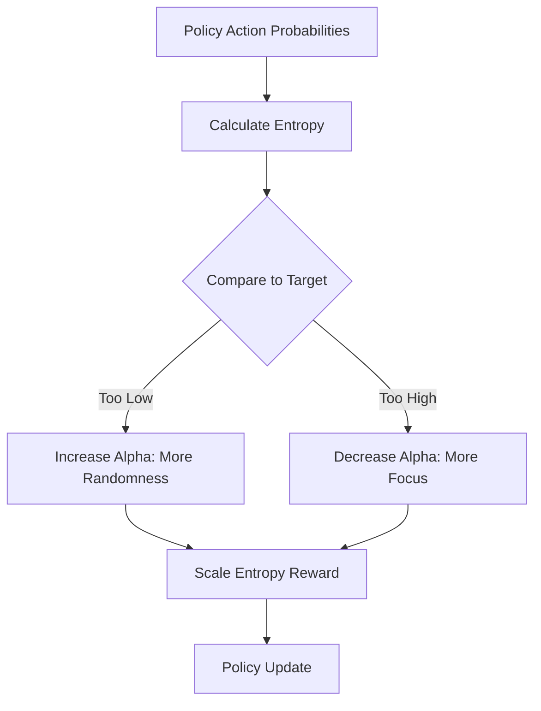

# SAC with Automated Temperature (Auto-Alpha)

🧠 **What does this do? (The Analogy)**
Think of a **Shower Valve**. In standard SAC, you have to manually set the temperature (Alpha). If it's too cold (low Alpha), the agent is "greedy" and doesn't explore. If it's too hot (high Alpha), the agent is too "random." **Auto-Alpha** is like a **Smart Thermostat**. You tell it your "Target Temperature" (Desired Entropy), and it automatically adjusts the valve to keep the exploration perfectly balanced throughout the whole training process.

🔍 **Step-by-Step Explanation:**
1. **Entropy ($\mathcal{H}$)**: A measure of how random the agent's actions are.
2. **The Problem**: At the start, the agent needs high randomness. Near the end, it needs to be precise. Setting one single value for the whole time is impossible.
3. **Target Entropy**: We set a goal for how random we want the agent to be (usually based on the number of possible actions).
4. **The Update**: If the agent's entropy drops below the target, we increase the "Temperature" ($\alpha$) to force it to explore more.

📊 **High-Level Design (HLD)**

✅ **Why use this?**
It makes SAC much more "robust." You don't have to spend days tuning the alpha hyperparameter. The agent "knows" when it needs to explore and when it's time to get serious.

🌍 **Real-World Examples:**
1. **Robot Locomotion**: A robot learning to walk might need lots of random leg movements at first to find its balance, but then needs very precise movements once it's standing.
2. **Dynamic Pricing**: An AI exploring different price points for a new product, automatically becoming "less random" as it discovers the optimal market price.
