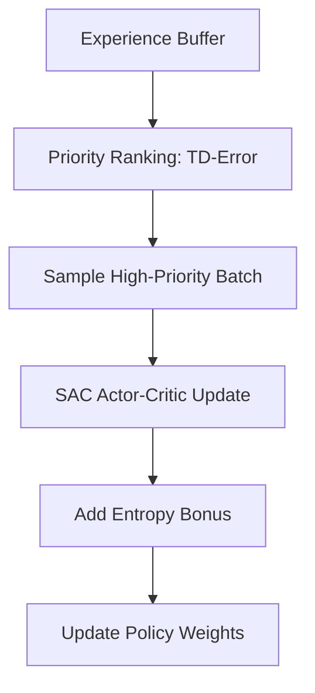

# SAC with Priority Experience Replay (SAC-PER)

🧠 **What does this do? (The Analogy)**
Think of a **Meditation Master** who is also a **Fast Learner**. Standard SAC is like a master who tries to be "random and calm" (Maximum Entropy) to explore everything. **SAC-PER** adds a **Focus System**. It says: "I should stay calm and explore, but I should spend 10x more time thinking about that one time I almost fell off the cliff." It combines the **creativity** of SAC with the **efficiency** of Priority Replay.

🔍 **Step-by-Step Explanation:**
1. **The SAC Foundation**: Uses the soft actor-critic logic (maximizing reward + entropy).
2. **Priority Sampling**: Instead of choosing past memories at random, it picks the ones where the agent was "most surprised" (High TD-error).
3. **Focused Entropy**: The agent learns to be "random" in the most important states first.
4. **The Benefit**: It converges much faster than standard SAC, especially in complex environments where most of the data is "boring" (like a robot driving down a straight road).

📊 **High-Level Design (HLD)**

✅ **Why use this?**
It is the "Industrial Strength" version of SAC. If you are training a real-world robot or a complex drone, you almost always use Priority Replay to make sure every second of training data is used effectively.

🌍 **Real-World Examples:**
1. **Autonomous Flight**: A drone learning to fly in heavy wind where 99% of the flight is normal, but the 1% of "wind gusts" are critical for learning.
2. **Complex Manufacturing**: An AI controlling a precision laser cutter where small errors are rare but must be studied intensely to prevent equipment damage.
