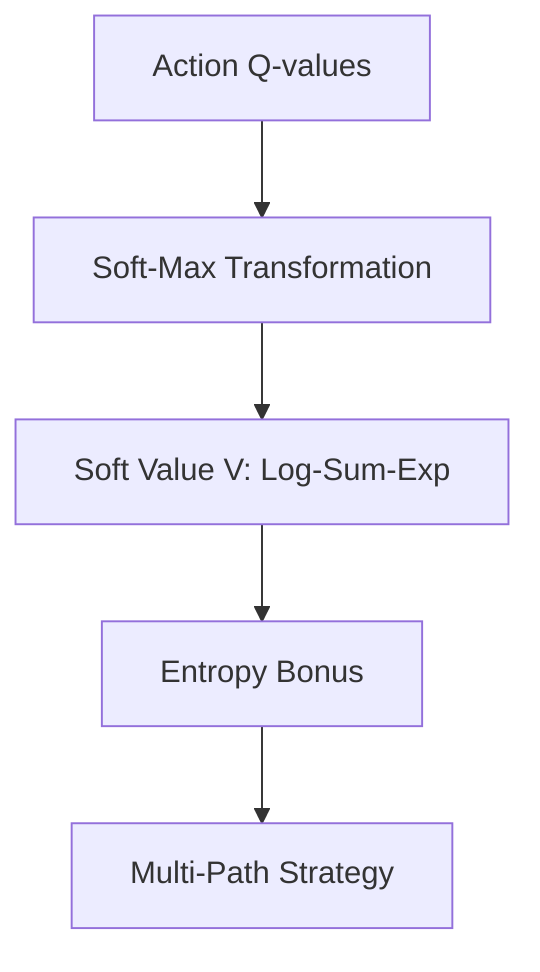

# Soft Q-Learning (SQL)

🧠 **What does this do? (The Analogy)**
Think of a **Gourmet Food Critic**. A standard critic (Hard Q-Learning) only cares about the #1 best restaurant and ignores everything else. A **Soft Critic** (SQL) says: "The Italian place is #1, but the Sushi place is a very close #2, and the Taco stand is a #3. I should keep visiting **all** of them because they are all pretty good!" By using **Entropy**, the AI stays "curious" and open-minded, which prevents it from getting stuck in a boring routine.

🔍 **Step-by-Step Explanation:**
1. **The Soft-Max**: Instead of $V(s) = \max Q(s, a)$, we use the **Log-Sum-Exp** formula.
2. **Maximum Entropy**: The agent is rewarded for being "uncertain." It wants to maximize Reward + Entropy.
3. **Probabilistic Action**: Instead of always picking the best action, it picks actions with a probability proportional to their $Q$-values.
4. **Benefit**: It is much more robust to noise and can learn multiple ways to solve a problem simultaneously.

📊 **High-Level Design (HLD)**

✅ **Why use this?**
It is the foundation of **SAC (Soft Actor-Critic)**, which is one of the most popular RL algorithms today. If you want an agent that is "Smooth" and "Creative" rather than "Rigid" and "Robotic," you use SQL.

🌍 **Real-World Examples:**
1. **Personalized News Feeds**: Instead of just showing the "top" news, SQL ensures a variety of interesting topics are shown to keep the user engaged.
2. **Warehouse Robot Paths**: Learning five different routes to the same shelf so that if one path is blocked by a human, the robot can instantly switch to another one.
