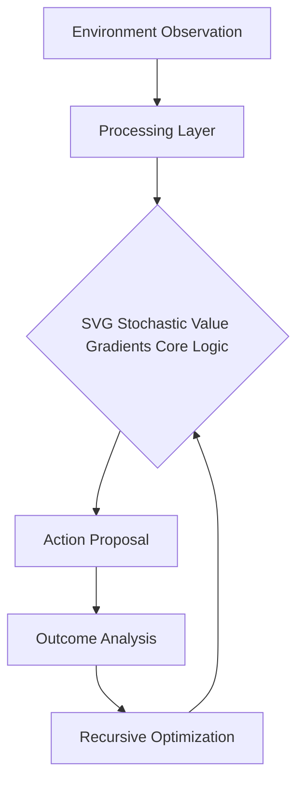

# SVG Stochastic Value Gradients

## 🧠 The Analogy
**A mountain climber who can feel exactly how the ground might crumble (Stochasticity) and uses that feeling to calculate the perfect path up.**

## 🚀 Overview
SVG uses reparameterization to backpropagate through stochastic environment transitions.

## 🔍 Key Concepts
1. **Optimization**: Maximizing long-term reward through specific architectural choices.
2. **Stability**: Ensuring the agent doesn't 'forget' or 'diverge' during training.
3. **Efficiency**: Reducing the number of samples needed to reach expert performance.

## 📊 High-Level Design (HLD)

## ⚖️ Pros and Cons
| Pros | Cons |
| :--- | :--- |
| Low variance gradients | Requires a differentiable world model |

---
*Created for the Reinforcement Learning Encyclopedia Project.*
