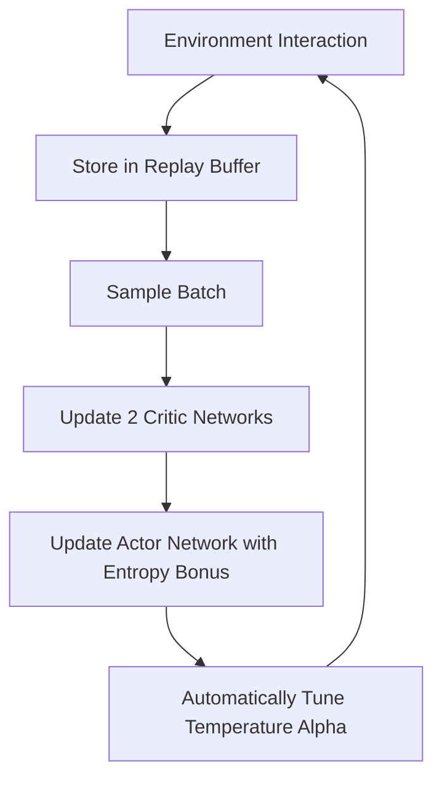

# Soft Actor-Critic (SAC) Deep Dive

## Introduction
SAC is a state-of-the-art **Off-Policy Actor-Critic** algorithm. It is unique because it uses **Maximum Entropy Reinforcement Learning**, where the agent's goal is to maximize both the expected reward and the randomness (entropy) of its actions.

## Core Concepts

### 1. Entropy Maximization
Most RL agents try to find the one "perfect" action. SAC tries to be as random as possible while still getting high rewards. This leads to **much better exploration** and more robust policies.

### 2. Off-Policy Learning
SAC uses a **Replay Buffer**, making it much more sample-efficient than PPO. You can reuse old data many times.

### 3. Double-Q Learning
Like DQN, SAC uses two critics (Double-Q) to reduce overestimation bias in value functions.

## High-Level Design (HLD)

## Why SAC is Better?
- **Sample Efficiency**: Much faster to train than PPO.
- **Exploration**: The entropy bonus prevents the agent from getting stuck in local optima.
- **Robustness**: Automatically adjusts how much it explores vs. exploits.

### Pros and Cons
| Pros | Cons |
| :--- | :--- |
| Extremely sample efficient | Complex to implement (many moving parts) |
| Best for continuous control (Robotics) | Computationally expensive per update |
| Very stable due to entropy tuning | Harder to debug than DQN or PPO |

---

## Interview Questions (Q&A)

**Q: What is "Entropy" in SAC?**
A: Entropy is a measure of randomness. By maximizing entropy, the agent is encouraged to explore all possible actions that lead to good rewards, rather than just sticking to one.

**Q: Why does SAC use two critics?**
A: To solve the "Overestimation Bias" problem. By taking the minimum value from two critics, the agent avoids being overly optimistic about poor actions.

**Q: When should I use SAC over PPO?**
A: Use SAC for robotics or continuous control tasks where you have a limited amount of data (high sample efficiency needed). Use PPO if you want something easier to tune and very stable.

---
*Created for Reinforcement Learning SAC Learning Path.*
