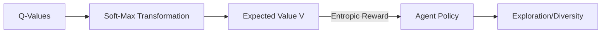

# Soft Q-Learning (Maximum Entropy RL)

🧠 **What does this do? (The Analogy)**
Think of a **Food Critic** at a buffet. A standard Q-learning critic only eats the single best dish (Pizza) and ignores everything else. A **Soft Q-learning** critic tries the Pizza 80% of the time, the Sushi 15% of the time, and the Tacos 5% of the time. By being "soft" and keeping its options open (Maximum Entropy), the agent explores more thoroughly and is much more robust if the Pizza suddenly runs out.

🔍 **Step-by-Step Explanation:**
1. **The Standard Q-Update**: $V(s) = \max_a Q(s, a)$. It is very "greedy."
2. **The Soft Q-Update**: $V(s) = \alpha \log \sum \exp(Q(s, a) / \alpha)$. This is the "Log-Sum-Exp" operator.
3. **Maximum Entropy**: The agent is rewarded not just for getting points, but for being **random/diverse** in its actions.
4. **The Benefit**: It prevents the agent from getting stuck in a "local optimum" (a good but not perfect strategy) and makes it much more resilient to environment changes.

📊 **High-Level Design (HLD)**

✅ **Why use this?**
It is the mathematical core of **SAC (Soft Actor-Critic)**. It allows agents to learn multi-modal behaviors (like finding three different ways to solve a puzzle) instead of just one.

🌍 **Real-World Examples:**
1. **Diversity in Recommendations**: A movie AI that recommends a mix of genres you might like, rather than just suggesting 100 Superhero movies because that's what you watched last.
2. **Robotics Manipulation**: Learning to pick up an object in many different ways (from the side, from the top, etc.) so it can still succeed if its "favorite" path is blocked.
