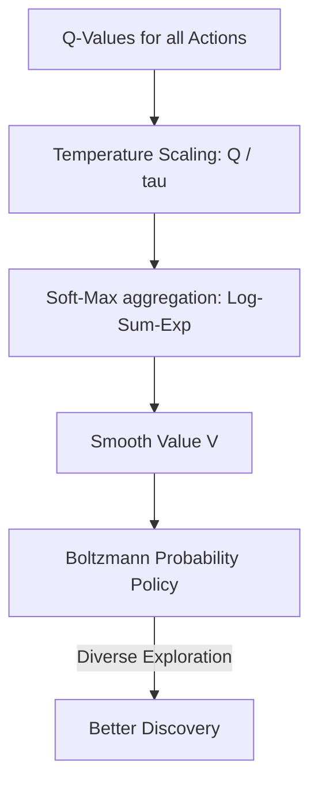

# Soft Q-Learning (Entropy Maximization)

🧠 **What does this do? (The Analogy)**
Think of a **Hiker exploring a Forest**. 
- Standard Q-Learning is like a hiker who finds one path to a mountain top and only ever walks that path. 
- **Soft Q-Learning** is like a hiker who gets a bonus reward for finding **New Paths**. Even if they already know a good path, they want to keep their options open (Maximum Entropy). 
Instead of using a "Hard Max" (pick the one best thing), it uses a **"Soft Max"** (value everything based on how good it is).

🔍 **Step-by-Step Explanation:**
1. **The Log-Sum-Exp**: Instead of $V(s) = \max_a Q(s,a)$, we use $V(s) = \tau \ln \sum \exp(Q(s,a)/\tau)$.
2. **Boltzmann Policy**: The probability of picking an action is proportional to $e^{Q/\tau}$. Good actions are picked more, but every action has a chance.
3. **Exploration-Exploitation**: The temperature $\tau$ acts as a knob. If $\tau$ is high, the agent is very random. If $\tau$ is low, it becomes greedy.
4. **Benefit**: This is the mathematical father of **Soft Actor-Critic (SAC)**. It allows for much better exploration and makes the AI more robust to changes in the environment.

📊 **High-Level Design (HLD)**

✅ **Why use this?**
It is the most principled way to handle **Exploration**. Instead of adding "Noise" (which is messy), you change the "Objective" of the AI to include "Diversity." This makes the learning process much smoother and more stable.

🌍 **Real-World Examples:**
1. **Robotic Grasping**: Learning to pick up an object from many different angles so that if one angle is blocked, the robot instantly knows 5 other ways to do it.
2. **Route Planning**: A GPS that doesn't just give you the "Fastest" route, but understands 3 or 4 "Good" routes so it can reroute you instantly if there is an accident.
