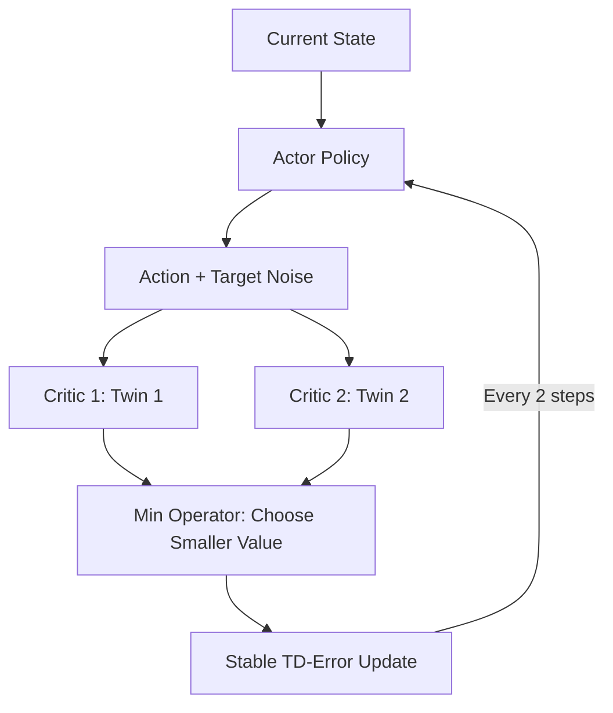

# TD3 (Twin Delayed DDPG)

🧠 **What does this do? (The Big Picture)**
Standard DDPG is like a student who is **Too Confident**. If they see a lucky high score once, they assume that action is a "Golden Ticket" and they never stop doing it (Overestimation Bias). **TD3** is a **Skeptical Student**. It uses two different critics (The Twins) to cross-check every score. If one twin says "This is worth 100 points" and the other says "It's only worth 20," TD3 **trusts the lower number**. This "pessimism" makes the AI incredibly robust and prevents it from falling into delusional traps.

🔍 **The 3 Stability Breakthroughs:**

1.  **Clipped Double Q-Learning**: $Q_{target} = R + \gamma \min(Q_1(s', a'), Q_2(s', a'))$. 
    - By always picking the smaller value, the AI never "over-estimates" its own success.
2.  **Delayed Policy Updates**: The actor (the brain) is updated half as often as the critic (the teacher). 
    - This allows the "teacher" to become stable before the "student" makes any big changes.
3.  **Target Policy Smoothing**: We add a tiny bit of random noise to the actions during training. 
    - This ensures that similar actions have similar values, preventing the AI from finding "glitches" in the game where one tiny specific movement gives a massive fake reward.

📊 **High-Level Design (HLD)**

✅ **Why use this?**
TD3 is often preferred over SAC in environments where **precise coordination** is more important than exploration. It is the gold standard for high-performance mechanical control (e.g., walking robots, drones, and autonomous vehicles) where stability is the #1 priority.

🌍 **Real-World Examples:**
1. **Precision Manufacturing**: A robotic arm that needs to place tiny components with 0.1mm accuracy. TD3 ensures the arm's movements are smooth and never "jittery."
2. **Autonomous Drones**: Flying in gusty winds—TD3 helps the drone ignore small random gusts (noise) and focus on the stable flight path.
