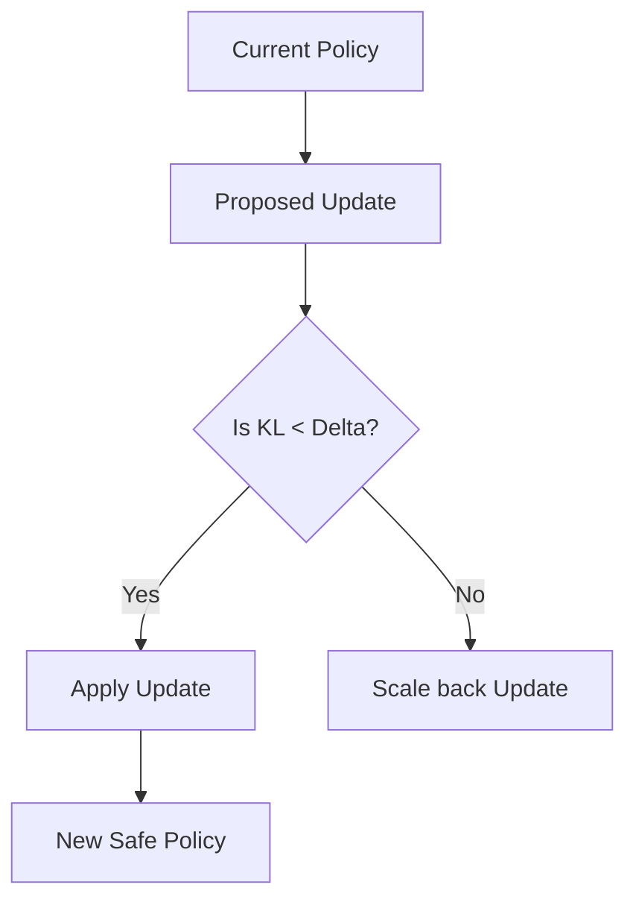

# Trust Region Policy Optimization (TRPO)

🧠 **What does this do? (The Analogy)**
Think of a **Hiker on a foggy mountain**. If the hiker takes a massive leap, they might fall off a cliff because they can't see the whole terrain. **TRPO** is like a safety rope. It says: "You can move in any direction you want, but you are **not allowed** to move more than 1 meter at a time." By keeping the changes small (the "Trust Region"), we ensure the hiker never makes a catastrophic mistake that ruins their progress.

🔍 **Step-by-Step Explanation:**
1. **The Policy Change**: We measure the difference between the Old Policy and the New Policy using **KL-Divergence**.
2. **The Constraint**: Instead of a simple learning rate, TRPO solves a mathematical optimization problem: "Maximize reward *subject to* KL-Divergence < $\delta$."
3. **Monotonic Improvement**: Mathematically, TRPO guarantees that the policy will never get worse (in theory).
4. **Relationship to PPO**: PPO is the "simplified" version of TRPO. While TRPO uses complex second-order math (Kullback-Leibler), PPO uses simple clipping.

📊 **High-Level Design (HLD)**

✅ **Why use this?**
It is incredibly stable. In environments where one "bad" update can cause the agent to forget everything it learned (catastrophic forgetting), TRPO provides a mathematical guarantee of safety.

🌍 **Real-World Examples:**
1. **Nuclear Reactor Control**: Ensuring the AI controller never makes a "radical" change to the cooling system that could cause a core meltdown.
2. **Satellite Orientation**: Keeping the satellite pointed at Earth with extreme precision, where a single large "jump" in logic could lose the signal forever.
