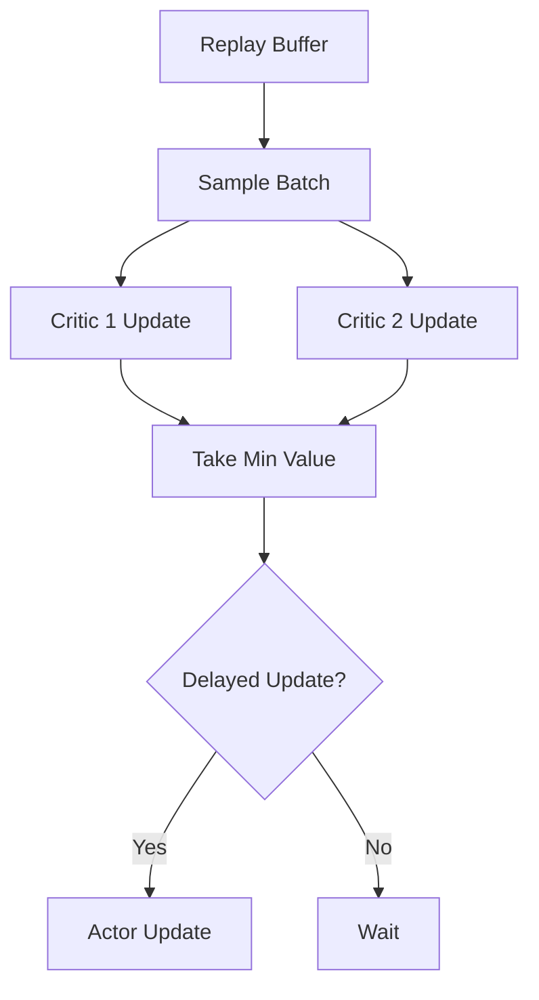

# Twin Delayed DDPG (TD3)

## Introduction
TD3 is a powerful algorithm for **Continuous Action Spaces** (like robotics). it is an improvement over DDPG (Deep Deterministic Policy Gradient) and addresses the issue of overestimation bias in Q-learning.

## The Three Improvements
1.  **Clipped Double-Q Learning**: Uses two critics and takes the minimum value to prevent overoptimism.
2.  **Target Policy Smoothing**: Adds noise to the target action to make the value function smoother.
3.  **Delayed Policy Updates**: Updates the actor network less frequently than the critic network to reduce variance.

## High-Level Design (HLD)

## Pros and Cons
| Pros | Cons |
| :--- | :--- |
| Highly stable continuous control | More hyperparameters to tune |
| Prevents Q-value overestimation | Requires more memory (Two critics) |
| SOTA for many robotics tasks | Complex implementation |

---

## Interview Questions
**Q: Why do we update the Actor less frequently in TD3?**
A: To allow the Critic (Value Function) to stabilize first. If the Actor updates based on an unstable Critic, it can lead to divergent behavior.

**Q: What is Target Policy Smoothing?**
A: It adds a small amount of noise to the actions selected by the target network. This forces the agent to learn that similar actions should have similar values, preventing it from exploiting sharp peaks in the Q-function.
