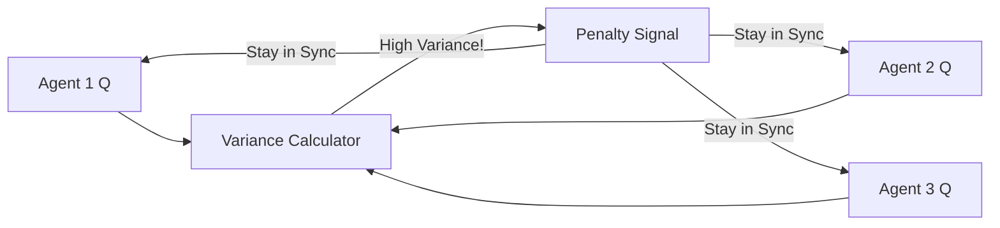

# VBC (Variance-Based Control)

🧠 **What does this do? (The Analogy)**
Think of a **Rowing Team**. If one person rows with 100% force and the other person rows with 10% force, the boat will spin in circles and crash. It doesn't matter how strong the individual rowers are—what matters is that they are **Consistent (Low Variance)**. **VBC** is an AI that rewards the team for "Acting Together." It penalizes agents that "Go Rogue" and do something completely different from the rest of the team, even if that agent thinks it's a good idea.

🔍 **Step-by-Step Explanation:**
1. **The Variance Penalty**: During training, the loss function includes a term that measures the "Spread" of the team's Q-values or actions.
2. **Behavior Smoothing**: If Agent A tries to jump while everyone else is walking, the VBC penalty lowers Agent A's score, forcing it to "Sync" with the team.
3. **Stability**: This prevents the "Non-Stationarity" problem where agents constantly change their behavior to chase small gains, which usually causes the whole team to fail.
4. **Benefit**: It produces "Calm" and "Predictable" team behavior, which is essential for real-world robotics.

📊 **High-Level Design (HLD)**

✅ **Why use this?**
It is essential for **Coordinated Movement**. If you have 4 robots carrying a heavy sheet of glass, you use VBC to ensure they all lift at exactly the same speed. If one robot lifts too fast, the glass breaks.

🌍 **Real-World Examples:**
1. **Legged Robot Balancing**: Ensuring all 4 legs of a robot dog are working in sync to maintain balance on ice.
2. **Satellite Formation Flying**: 10 satellites moving in a perfect circle. VBC ensures that none of them "drift" too far from the group's average speed.
