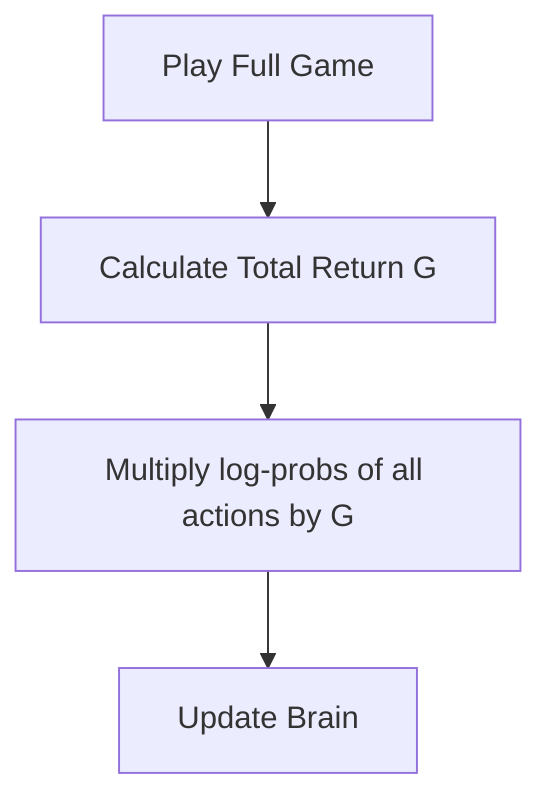

# Vanilla Policy Gradient (VPG)

🧠 **What does this do? (The Analogy)**
Think of a **Dog Trainer with a Whistle**. The trainer doesn't know *why* the dog is doing a specific trick; they just watch. If the dog does something good, the trainer blows the whistle and gives a treat. **VPG** is the same: it doesn't care about "Value" or "Math Models." It just says: "If this sequence of actions ended with a high score, let's do more of **exactly** that in the future."

🔍 **Step-by-Step Explanation:**
1. **The Trajectory**: The agent plays a full game and records every action it took.
2. **The Reward ($G$)**: At the end, it sees the total score.
3. **The Update**: For every action in that game, it updates the brain: $\text{Weight} = \text{Weight} + \alpha \nabla \log \pi(a|s) G$.
4. **Simplification**: It's the most "Direct" way to learn. You don't guess the value of a state; you just learn which actions were part of a winning game.

📊 **High-Level Design (HLD)**

✅ **Why use this?**
It is the "Great Grandfather" of modern RL. While it is too simple for complex games (like StarCraft), it is the easiest way to understand how an AI can learn to act without ever knowing "Q-values" or "Bellman Equations."

🌍 **Real-World Examples:**
1. **Simple Robotic Gripper**: Learning to pick up a ball by trying 100 random grabs and simply repeating the ones that were successful.
2. **Online Ad Selection**: A very basic system that shows 10 different ads and simply increases the frequency of the ones that were eventually clicked.
