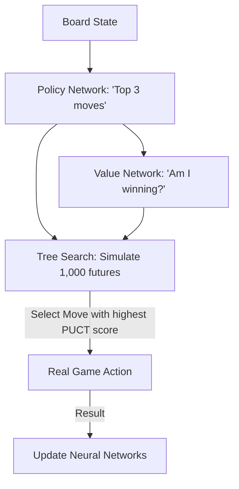

# AlphaGo Master (PUCT Search)

🧠 **What does this do? (The Analogy)**
Think of a **Grandmaster choosing a Chess move**. 
- They don't just look at every move (too slow). 
- They look at the **Most Likely** good moves first (The Policy). 
- But they also "double-check" moves they haven't spent much time on yet, just in case (The Confidence/PUCT). 
**AlphaGo Master** is an AI that combines **Deep Intuition** (Neural Networks) with **Brute Force Math** (Tree Search). It thinks 10 steps ahead by only exploring the paths that its "intuition" says are worth looking at.

🔍 **Step-by-Step Explanation:**
1. **The Policy ($\pi$)**: A neural network that guesses the best moves instantly.
2. **The Value ($V$)**: A neural network that predicts who is currently winning.
3. **MCTS (Monte Carlo Tree Search)**: The AI "simulates" thousands of games in its head.
4. **PUCT (Selection Rule)**: The AI picks a move based on: [Winning Record] + [Intuition / (1 + Times Checked)].
5. **Benefit**: It can beat the best human in the world at Go, a game with more possible moves than there are atoms in the universe.

📊 **High-Level Design (HLD)**

✅ **Why use this?**
It is the standard for **Planning in Perfect Information Games**. If you have a problem with a known set of rules (like Chess, Shogi, or Logic Puzzles), AlphaGo Master is the strongest logic engine in history.

🌍 **Real-World Examples:**
1. **Supply Chain Games**: Managing a global network of ships and warehouses by simulating thousands of "future storms" and picking the most resilient move.
2. **Chip Design**: Placing billions of transistors on a computer chip by treating the layout like a game of Go.
