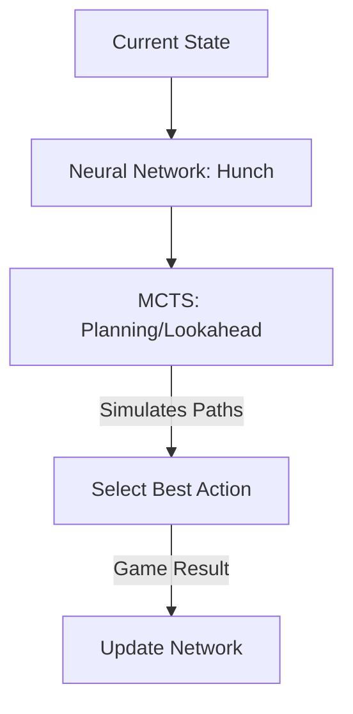

# AlphaZero (MCTS + Reinforcement Learning)

🧠 **What does this do? (The Analogy)**
Think of a **Grandmaster Chess Player**. Standard RL is like a player who plays by "intuition" (fast but sometimes shallow). **AlphaZero** combines this intuition with **Planning** (slow but deep). The Neural Network provides the "hunch" (which moves look good), and Monte Carlo Tree Search (MCTS) "thinks ahead" by simulating thousands of future moves to see if that hunch is actually correct.

🔍 **Step-by-Step Explanation:**
1. **The Policy & Value Network**:
   - The network predicts $P(s, a)$ (which move to make) and $V(s)$ (who is winning).
2. **MCTS (Lookahead)**:
   - Instead of just following the network, the agent builds a search tree.
   - It uses the network's "hunch" to prioritize which branches to explore.
3. **Self-Play**:
   - The agent plays against itself. The MCTS search results are used as the "teacher" to train the next version of the neural network.
4. **Closing the Loop**:
   - The network gets better at predicting the MCTS result, and MCTS gets better because it has a better network to guide it.

📊 **High-Level Design (HLD)**

✅ **Why use this?**
It is the ultimate algorithm for games with **perfect information** (Chess, Go, Shogi). It doesn't need any human knowledge—it learns entirely by playing against itself and "thinking ahead."

🌍 **Real-World Examples:**
1. **Logistics Optimization**: Planning complex shipping routes where every decision has long-term consequences.
2. **Drug Discovery**: Searching through millions of chemical combinations (MCTS) while using a neural network to predict which ones are likely to be safe/effective.
