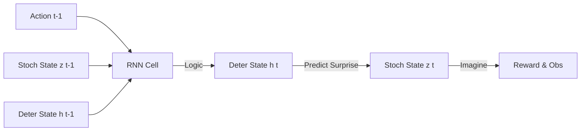

# RSSM (Recurrent State Space Model)

🧠 **What does this do? (The Big Picture)**
Think of a **DREAM**. When you dream, your brain handles two things: 
1.  **Logic (Deterministic)**: "If I open the door, I will be in the kitchen." 
2.  **Surprise (Stochastic)**: "What will be inside the fridge? It could be milk, or it could be a dragon."
**RSSM** is the mathematical engine of the DreamerV3 algorithm. It combines a **Regular Brain (RNN)** for the logic and a **Probabilistic Brain (Categorical)** for the surprises. This allows an AI to imagine millions of realistic "Dreams" about the future and learn how to solve problems entirely inside its own mind.

🔍 **The Dual-State Architecture:**

1.  **Deterministic State ($h_t$)**:
    - Managed by a GRU or RNN. 
    - It remembers the "History" of what has happened so far. 
    - It provides a stable foundation for planning.
2.  **Stochastic State ($z_t$)**:
    - Managed by **Categorical Distributions** (32 groups of 32 variables).
    - It captures the "Uncertainty" of the world. 
    - Instead of one single number, it uses a code that can represent many different possibilities at once.
3.  **The Interaction**: $h_t = f(h_{t-1}, z_{t-1}, a_{t-1})$. The next logical state depends on the previous logic, the previous surprise, and the action taken.

📊 **High-Level Design (HLD)**

✅ **Why use this?**
RSSM is the secret to **Sample Efficiency**. Because the AI can learn from its own dreams, it needs much less time in the real world. DreamerV3 was the first algorithm to master Minecraft from scratch using only raw pixels and zero human data, thanks to the power of RSSM.

🌍 **Real-World Examples:**
1. **Supply Chain Resiliency**: Imagining thousands of "Disaster Scenarios" (port closures, storms) to find the most robust shipping routes.
2. **Autonomous Mining**: Training heavy machinery to operate in dark, dusty caves by learning a world-model that can "predict" where obstacles might be even when the camera is blinded.
