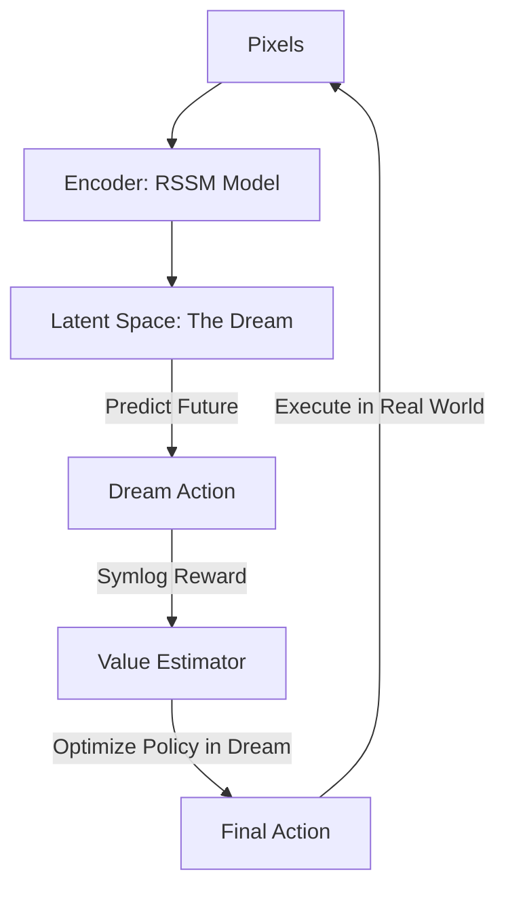

# Dreamer V3 (Scaling World Models)

🧠 **What does this do? (The Analogy)**
Think of a **Person who can learn any game instantly**. 
- Whether they are playing "Tic-Tac-Toe" (Simple) or "Global Economic Simulator" (Complex), they don't have to change their brain. 
- **Dreamer V3** is the first RL algorithm that uses **Universal Scaling**. 
- It uses a mathematical trick called **Symlog** to "squish" numbers. If a game gives a reward of 1 point or 1,000,000 points, Dreamer V3 treats them both correctly without getting confused. 
It is the "General Purpose" brain of the RL world.

🔍 **Step-by-Step Explanation:**
1. **World Model**: The AI learns to "Dream." It predicts the future in a compact "Latent Space" instead of using raw pixels.
2. **Symlog Scaling**: It "compresses" large numbers. This is why it can play Minecraft (huge rewards) and Atari (tiny rewards) with the **exact same settings**.
3. **Discrete Latents**: It uses "Codebooks" (Vectors) to represent the world, making its dreams more stable and less "blurry."
4. **Benefit**: It is the **Current SOTA for Model-Based RL**. It is the first model to collect diamonds in Minecraft from scratch without any human help.

📊 **High-Level Design (HLD)**

✅ **Why use this?**
It is the best choice for **Complex, Long-Term Goals**. If you are building an AI that needs to work for hours or days to reach a goal (like building a house or managing a factory), Dreamer V3's ability to "Dream" and "Scale" is unmatched.

🌍 **Real-World Examples:**
1. **Minecraft AI**: The first AI to mine a Diamond from scratch using only raw pixels as input.
2. **Industrial Robotics**: Managing a factory with 1,000 sensors where some sensors have small numbers and some have huge numbers.
3. **Autonomous Mining**: Controlling massive digging machines in a dangerous environment by "dreaming" about the safest paths.
