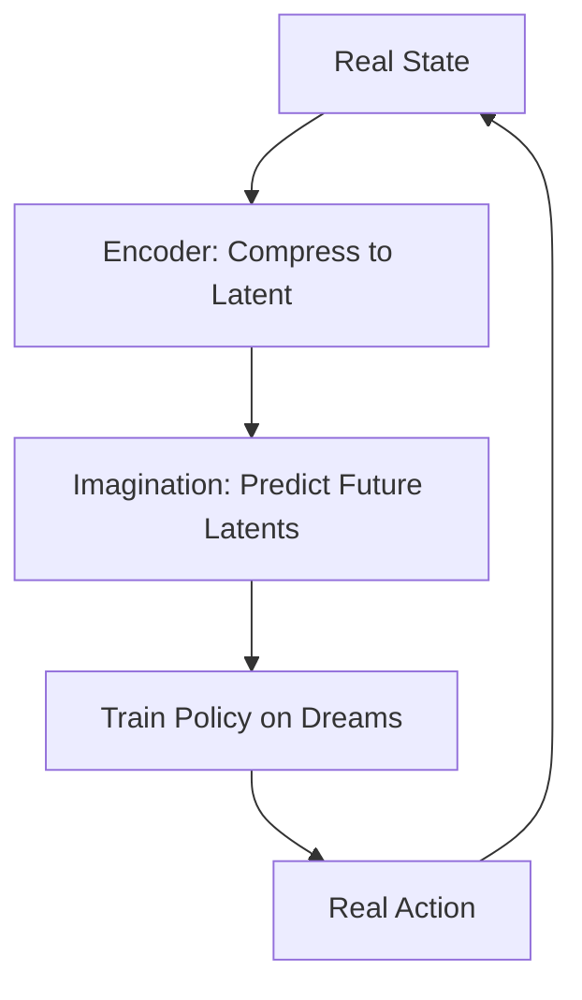

# Dreamer (World Models in Latent Space)

🧠 **What does this do? (The Analogy)**
Think of a **Grand Strategist**. Standard RL is like a soldier on the battlefield reacting to every bullet. **Dreamer** is like the strategist who looks at a map and thinks: "If I move my troops here, I expect the enemy to move there." Crucially, Dreamer doesn't imagine every detail (like the color of the grass); it imagines the **essence** of the situation (Latent Space). It can "dream" 50 steps into the future in a fraction of a second.

🔍 **Step-by-Step Explanation:**
1. **World Model (RSSM)**:
   - The agent learns to compress the complex world into a small "Latent Vector" (a digital summary).
   - It learns to predict how this summary changes when it takes an action.
2. **Dreaming**:
   - The agent freezes the real world and enters its "Dream State."
   - It plays millions of games against its own internal World Model.
3. **Actor-Critic Update**:
   - It trains its Actor and Critic purely on these "Imagined Trajectories."
4. **Action**:
   - When it returns to the real world, it is already an expert because it has practiced in its head thousands of times.

📊 **High-Level Design (HLD)**

✅ **Why use this?**
It is the most **Sample Efficient** algorithm for complex visual tasks. It can learn to control a robot from raw camera pixels using 100x less data than standard algorithms like PPO or SAC.

🌍 **Real-World Examples:**
1. **Autonomous Warehousing**: Robots predicting how stacked boxes might fall if they move a pallet, allowing them to "plan" safe movements.
2. **Deep Space Exploration**: Probes that must make complex decisions with zero lag, simulating hundreds of "what-if" scenarios in their mind before committing to an action.
