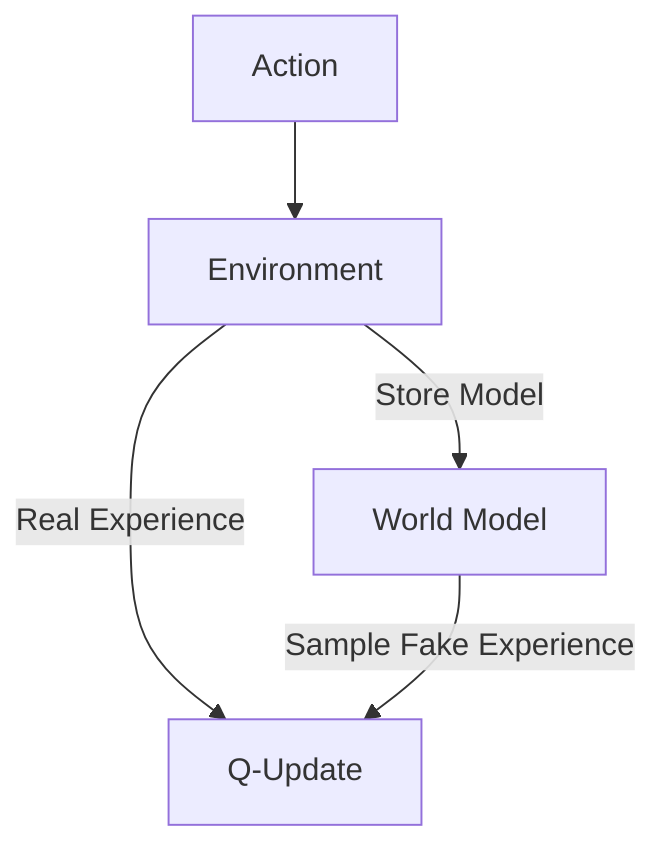

# Dyna-Q (Model-Based RL)

🧠 **What does this do? (The Analogy)**
Think of a **Student studying for a test**. When they solve a practice question, they learn something (Real Experience). But after they finish the question, they sit back and **think about it** 5 more times in their head (Imagination/Planning). Because they "re-live" the experience in their mind, they learn 5x faster than a student who just moves on to the next question immediately.

🔍 **Step-by-Step Explanation:**
1. **Direct RL**: The agent takes an action in the real world and updates its Q-table.
2. **Model Learning**: The agent stores $(s, a, r, s')$ in its "Memory Bank" (the Model).
3. **Planning**: During every step, the agent pauses and samples random past experiences from its Memory Bank.
4. **Imaginary Updates**: It updates its Q-table using these "fake" steps as if they were happening right now.
5. **Efficiency**: This makes the agent incredibly fast at learning, especially in simple environments where "imagination" is easy.

📊 **High-Level Design (HLD)**

✅ **Why use this?**
It is the most famous algorithm for proving that **thinking** (planning) is just as important as **doing** (acting). It is the simpler ancestor of modern algorithms like Dreamer and MuZero.

🌍 **Real-World Examples:**
1. **Inventory Forecasting**: An AI that learns from real sales data, then "simulates" thousands of different demand scenarios in its mind to prepare for the holidays.
2. **Game Playing (Noughts and Crosses)**: Learning to play perfectly in just a few games because the AI "imagines" every possible counter-move after every real turn.
