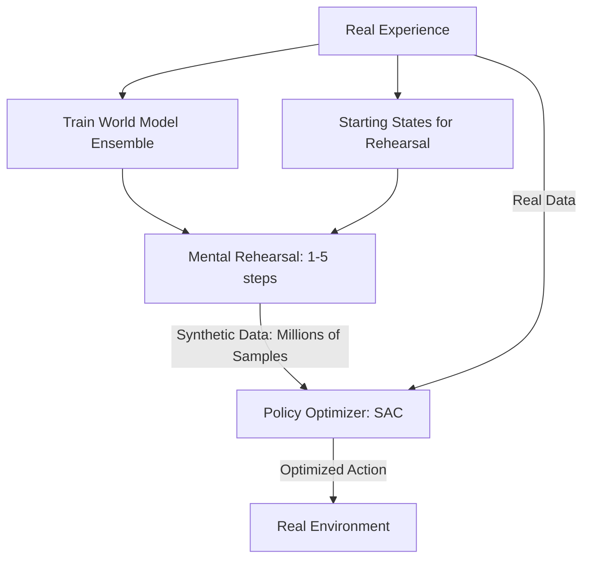

# MBPO (Model-Based Policy Optimization)

🧠 **What does this do? (The Analogy)**
Think of a **Musician practicing a new song**. 
- They play the song once (Real Experience). 
- Then, they close their eyes and **Rehearse** just the hardest 3-second riff in their head 100 times (Short Rollout). 
- They don't try to rehearse the whole 10-minute song in their head because they will forget the details. 
**MBPO** is an AI that uses a World Model to practice **Short (1-5 step)** sequences millions of times. This makes it 10x faster than standard AI because it is "Thinking" while it's not actually moving.

🔍 **Step-by-Step Explanation:**
1. **Real Data**: Collect a small amount of real experience.
2. **Train Model**: Train an ensemble of World Models (like PETS) on that data.
3. **Short Rollouts**: Use the model to generate millions of **Synthetic Memories** starting from real states, but only for 1-5 steps into the future.
4. **Policy Update**: Use a "Model-Free" algorithm (like SAC) to learn from both the Real AND the Synthetic data.
5. **Benefit**: Short rollouts are very accurate, while long ones accumulate "Model Errors" and become "Hallucinations." MBPO finds the "Perfect Balance."

📊 **High-Level Design (HLD)**

✅ **Why use this?**
It is one of the **Highest-Performance** algorithms in the world for "Sim-to-Real" transfer. It consistently beats almost every other algorithm on standard benchmarks (MuJoCo).

🌍 **Real-World Examples:**
1. **Precision Manufacturing**: A robot arm that "rehearses" the last 1cm of a movement 1,000 times in its head to ensure a perfect fit.
2. **Autonomous Drones**: Using the model to "rehearse" bank-turns during flight to stay perfectly stable in wind.
