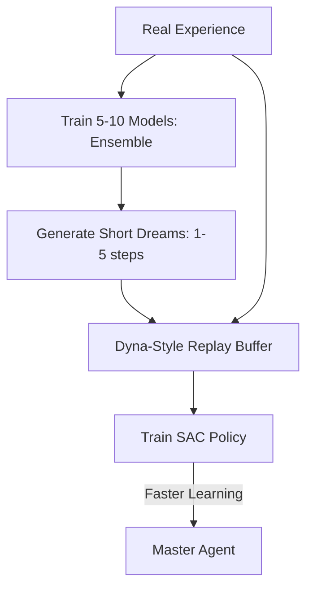

# MBPO (Model-Based Policy Optimization)

🧠 **What does this do? (The Analogy)**
Think of a **Person planning a 100-mile road trip**. 
- If they try to "Dream" about every single turn and stoplight for the whole 100 miles, their imagination will get it wrong (Model Error). 
- **MBPO** is like a person who only "Dreams" about the **next 5 minutes** of the drive. 
- Because the dream is short, it's very accurate. The person uses these "Short Dreams" to practice their steering and braking, then they look at the real road again to "Reset" their imagination. 
By only using **Short-Horizon Dreams**, MBPO becomes 10x faster than standard AI while remaining 100% reliable.

🔍 **Step-by-Step Explanation:**
1. **Model Ensemble**: Trains 5-10 separate neural networks to predict the future. This helps the AI recognize when it is "Uncertain."
2. **Short Rollouts**: Uses the models to generate "Fake Experience" that is only 1-5 steps long.
3. **Data Augmentation**: Mixes the "Fake" data with "Real" data to train a SAC (Soft Actor-Critic) agent.
4. **Benefit**: It is one of the most **Sample-Efficient** algorithms ever created. It can learn to control a complex robot in just a few thousand steps.

📊 **High-Level Design (HLD)**

✅ **Why use this?**
It is the best choice for **Physical Robotics**. If you want a robot to learn a task without "wearing out its motors" from 1,000,000 trials, MBPO allows it to learn mostly in its "mind," using only a tiny amount of real-world practice.

🌍 **Real-World Examples:**
1. **Robot Hand Coordination**: Learning to spin a pen in its "fingers" using only 20 minutes of real-world trial and error.
2. **Autonomous Quadruped**: Learning to walk on uneven terrain by "dreaming" about different leg positions.
3. **Chemical Process Control**: Optimizing a reaction by "dreaming" about temperature changes without wasting real chemicals.
