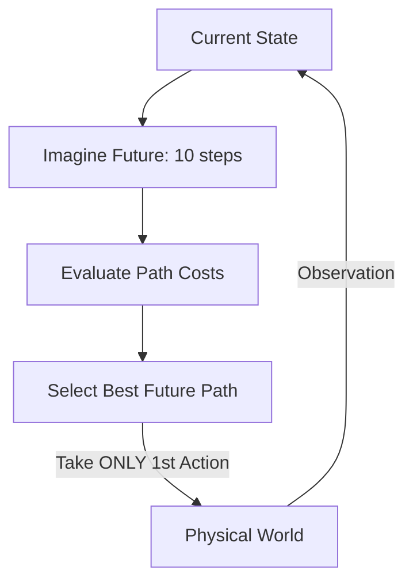

# Model Predictive Control (MPC)

🧠 **What does this do? (The Analogy)**
Think of a **Chess Grandmaster**. They don't just react to your move. They look 10 moves into the future, imagining every possible outcome. **MPC** does the same for machines. At every second, the AI runs a **Mental Simulation** of the next 10-20 seconds. It picks the "Best Path" for the future, takes the **first step**, and then immediately recalculates everything. It is a "Live Plan" that constantly adapts to reality.

🔍 **Step-by-Step Explanation:**
1. **The Model**: The AI has a physics model ($x_{t+1} = f(x_t, u_t)$).
2. **The Horizon ($H$)**: How far into the future the AI should "dream."
3. **Optimization**: At every time step $t$, the AI solves a math problem: "What sequence of actions $u_t, \dots, u_{t+H}$ gives me the most reward?"
4. **Receding Horizon**: The AI only executes the **first action** ($u_t$). Then it sees where it actually landed and plans again for $t+1$.
5. **Formula**: 
   $$\min_u \sum_{k=0}^H \text{Cost}(x_{t+k}, u_{t+k})$$

📊 **High-Level Design (HLD)**

✅ **Why use this?**
It is the standard for **SpaceX Rockets** and **Self-Driving Cars**. When a rocket is landing, it uses MPC to constantly re-plan its engine thrust to hit the landing pad perfectly, even in high winds. It is much more robust than standard RL for complex mechanical tasks.

🌍 **Real-World Examples:**
1. **Tesla Autopilot**: Planning the steering and braking path for the next 5 seconds to stay in the lane and avoid other cars.
2. **Chemical Refineries**: Managing thousands of valves and heaters to keep the chemicals at the perfect temperature while maximizing output.
