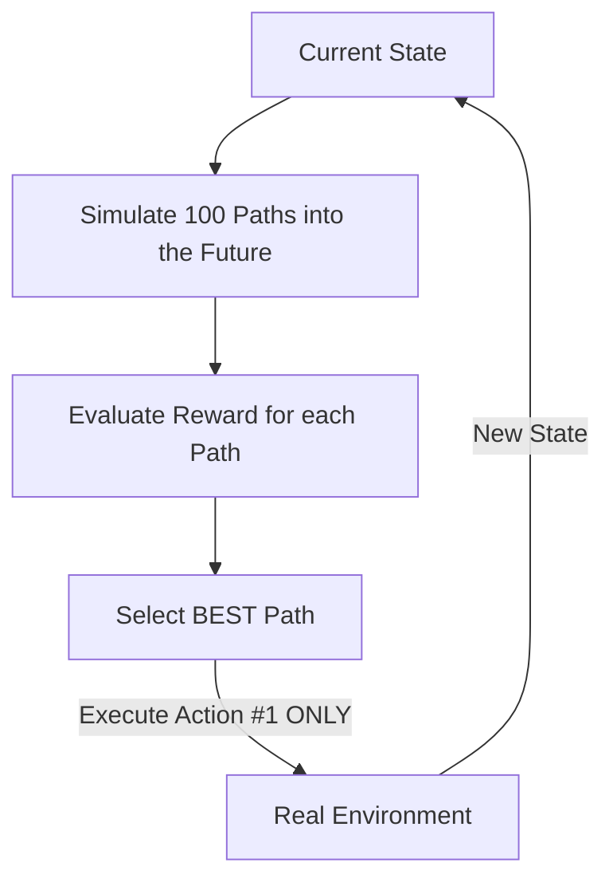

# MPC (Model Predictive Control RL)

🧠 **What does this do? (The Analogy)**
Think of a **Grandmaster in Chess**. 
1. They don't just "React" to your move. 
2. They close their eyes and **Simulate** the next 10 moves in their head. 
3. They try 100 different "What-if" scenarios. 
4. Once they find the scenario that ends with them winning, they make **the first move** of that scenario. 
5. Then, they open their eyes, see what you *actually* did, and repeat the whole process. 
**MPC** is an AI that uses a "World Model" to look into the future before making any real-world decision.

🔍 **Step-by-Step Explanation:**
1. **The World Model**: A neural network that has learned the "Physics" of the environment (State + Action -> Next State).
2. **Simulation (Rolling out)**: The agent simulates 1,000 different action sequences into the future (e.g., 5 seconds ahead).
3. **Selection**: It picks the sequence that results in the highest reward.
4. **Receding Horizon**: It executes only the **First** action of that sequence.
5. **Re-planning**: It observes the new state and repeats the simulation. This makes it extremely robust to unexpected changes.

📊 **High-Level Design (HLD)**

✅ **Why use this?**
It is the gold standard for **High-Performance Control**. If you want a drone to fly through a window at 50mph, or a robot to catch a falling glass, you use MPC. It is much more precise than standard "Model-Free" RL because it knows exactly *why* it's moving.

🌍 **Real-World Examples:**
1. **Self-Driving Car Path Planning**: Simulating the next 3 seconds of driving to ensure the car stays in the lane while avoiding other cars.
2. **Industrial Chemical Plants**: Balancing temperatures and pressures in a massive factory by simulating the chemical reactions minutes in advance.
