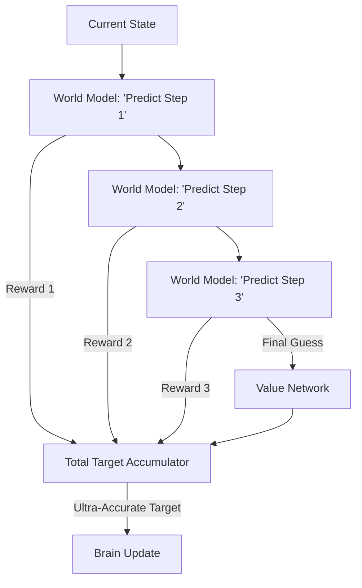

# MVE (Model Value Expansion)

🧠 **What does this do? (The Analogy)**
Think of a **Person trying to guess how much money they will have in 10 years**. 
- A normal AI (TD-Learning) just asks: "How much money will I have next year?" and assumes the year after that will be the same. 
- **MVE** is like a person who uses a **Financial Model** to calculate exactly what will happen in years 1, 2, and 3, and only **then** makes a guess about year 10. 
By "Expanding" the target using a model for the first few steps, the AI's "Guess" about the distant future becomes much more accurate and grounded in reality.

🔍 **Step-by-Step Explanation:**
1. **Model-Based Targets**: Instead of using the "Reward + Next State Value," it uses "Reward 1 + Reward 2 + Reward 3 + Future Value."
2. **Horizon H**: The number of steps the AI "Imagines" before it starts using its neural network guess.
3. **Bias Reduction**: Neural networks are often "biased" (they consistently guess too high or too low). Using a physics model for the first few steps reduces this bias significantly.
4. **Benefit**: It learns **Incredibly Fast**. By getting "more truth" into every update, the AI can learn a task in 50,000 steps that would take 1,000,000 steps for a normal AI.

📊 **High-Level Design (HLD)**

✅ **Why use this?**
It is the best choice for **Sparse Rewards**. If your AI only gets a point every 100 steps, MVE allows it to "see" that point coming from much further away, making the learning process much smoother.

🌍 **Real-World Examples:**
1. **Rocket Landing**: Simulating the next 5 seconds of flight to ensure the "Value" of the current trajectory is calculated correctly based on physics.
2. **Energy Grid Management**: Planning the next 4 hours of power usage using a weather model to improve the long-term "Value" of the batteries.
3. **Chess AI (Search-based)**: Using 3 steps of lookahead before asking the "Value Network" who is winning.
