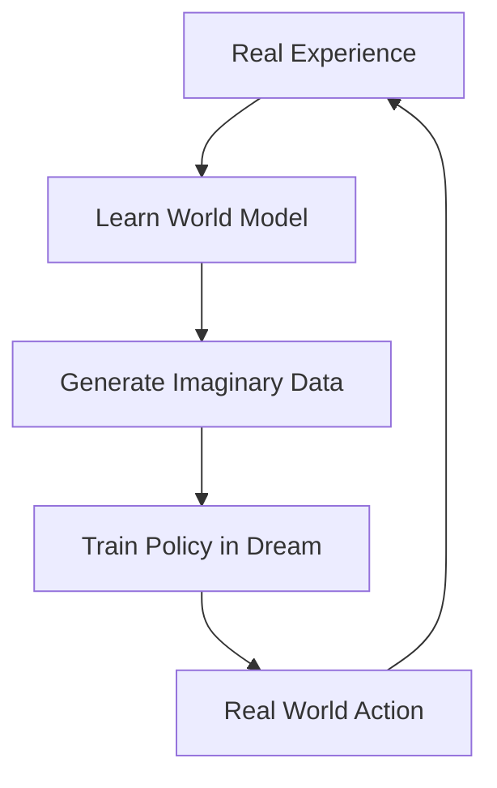

# Model-Based Reinforcement Learning

🧠 **What does this do? (The Analogy)**
Think of a **Dreamer**. Most RL agents (Model-Free) are like someone who learns to ride a bike by falling down 1000 times. A Model-Based agent is like someone who sits down, closes their eyes, and **imagines** what will happen if they lean left or right. Because they can "see" the future in their mind, they need far fewer real-world crashes to learn.

🔍 **Step-by-Step Explanation:**
1. **The World Model**:
   - The agent learns a mathematical function $S_{next} = f(S, A)$.
   - It basically learns the "Laws of Physics" of its environment.
2. **Imagination (Dyna)**:
   - The agent can generate "fake" experiences in its mind.
   - It trains its policy on these imagined dreams.
3. **Planning**:
   - Before taking a real action, it can simulate 100 different paths and pick the one that leads to the best goal.

📊 **High-Level Design (HLD)**

✅ **Why use this?**
It is **Sample Efficient**. In expensive environments (like a real $1M robot), you cannot afford to fail 10,000 times. You learn a model fast and do the rest of the learning in simulation.

🌍 **Real-World Examples:**
1. **Autonomous Flight**: Drones use model-based RL to predict wind resistance and battery drain before making a turn.
2. **Chemical Plants**: Simulating chemical reactions is safer and cheaper than running real experiments that might cause an explosion.
