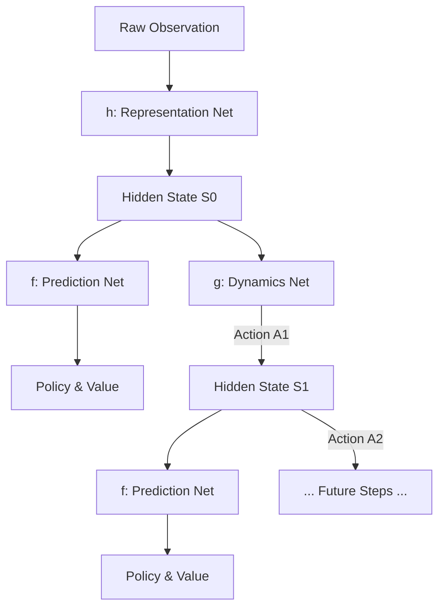

# MuZero (Planning Without a Model)

🧠 **What does this do? (The Big Picture)**
Think of a **Grandmaster playing Chess in their head**. They don't look at the board after every move; they close their eyes and "dream" the future. **MuZero** is a massive breakthrough because it doesn't need to know the rules of the game. It **learns its own version of the rules** (Latent Dynamics). It turns raw pixels into a "Secret Code" (Latent Space) and learns how that code changes when actions are taken. It then plays millions of "Mental Games" every second to find the perfect move.

🔍 **The Three Core Functions:**

1.  **Representation ($h$): $s_{latent} = h(o_1, \dots, o_t)$**
    - Converts the complex outside world (pixels/sensors) into a simplified mathematical summary.
2.  **Dynamics ($g$): $r_k, s_k = g(s_{k-1}, a_k)$**
    - The "Internal Physics" engine. It predicts how the hidden summary changes and what the reward will be without actually seeing the world.
3.  **Prediction ($f$): $p_k, v_k = f(s_k)$**
    - The "Intuition" engine. It looks at a hidden state and instantly guesses the best policy ($p$) and the likely outcome ($v$).

📊 **High-Level Design (HLD)**

✅ **Why use this?**
MuZero is the **current world champion** of game AI. It is the first algorithm to master Chess, Go, and Shogi *and* every single Atari game without being told the rules. If you have a problem where the "physics" are unknown or too complex to calculate (like the stock market or weather), MuZero is the strongest possible planning tool.

🌍 **Real-World Examples:**
1. **Video Compression**: YouTube uses MuZero-style planning to find the most efficient way to compress videos without losing quality.
2. **Industrial Robotics**: Training a robot to fold clothes—a task where the "physics" of soft fabric are too complex for a standard model, but MuZero can "dream" the solutions.
