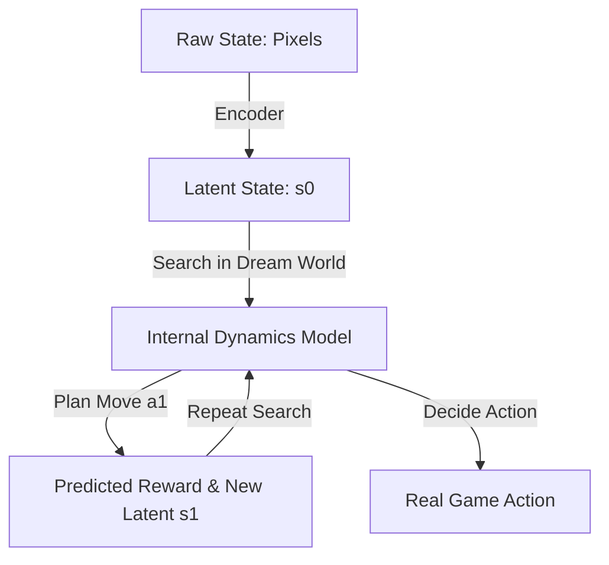

# MuZero Dynamics (Latent Planning)

🧠 **What does this do? (The Analogy)**
Think of a **Person playing a video game without a screen**. 
- They can't see the pixels, but they have a "Mental Model" of what is happening. 
- They think: "If I press Right, my character (wherever it is) moves closer to the goal." 
- **MuZero** is the most advanced RL in history because it **doesn't need to see the rules**. 
- It creates its own "Internal Language" (Latent Space) to represent the game. It plans its moves in this "Dream World" and then applies them to the real game.

🔍 **Step-by-Step Explanation:**
1. **Representation**: Turns the pixels into a hidden "Latent State" $s$.
2. **Dynamics**: A neural network that predicts "If I am in latent state $s$ and I do Action $a$, what will my new latent state be?"
3. **Prediction**: A neural network that predicts the Reward and the Policy from the latent state.
4. **Planning**: Use AlphaGo-style tree search inside the **Dream World** (The Dynamics model).
5. **Benefit**: It is the first AI to master Atari, Chess, and Go using the exact same code. It doesn't need to be "told" how the game works.

📊 **High-Level Design (HLD)**

✅ **Why use this?**
It is the current **SOTA for Model-Based RL**. It is perfect for any problem where you don't have a perfect "Simulator" but you want the power of 1,000-step-ahead planning.

🌍 **Real-World Examples:**
1. **YouTube Video Compression**: Using MuZero to decide the perfect way to compress a video frame-by-frame to maximize quality for the user.
2. **Industrial Control**: Managing a chemical plant where the "Rules" are too complex for a human to write down, but MuZero can "Dream" about the chemistry and find the best settings.
