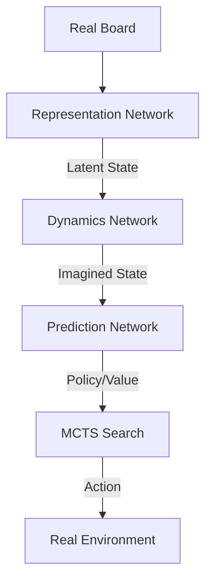

# MuZero (Planning Without a Model)

🧠 **What does this do? (The Analogy)**
Think of a **Genius Chess Player** who has never seen a rulebook. Standard AlphaZero needs to know the rules (how a knight moves). **MuZero** is so smart it **invents its own internal rules**. It plays the game and learns: "If I move this piece here, I feel like I'm winning, and the board looks like this." It builds a **Mental Simulation** of the game that doesn't necessarily look like Chess but works perfectly for planning 50 moves ahead.

🔍 **Step-by-Step Explanation:**
1. **Representation**: Compresses the board into a "Latent State" (a hidden code).
2. **Dynamics**: Learns a function $S_{next} = f(S, A)$ and $Reward = g(S, A)$ purely in that hidden code.
3. **Prediction**: A policy network predicts the best move and the value of that hidden code.
4. **MCTS**: It uses Monte Carlo Tree Search to plan inside its own "Mental Rules," never needing to ask the real environment what the rules are.

📊 **High-Level Design (HLD)**

✅ **Why use this?**
It is the most powerful RL algorithm ever created. It beat AlphaZero at Chess/Go and beat the state-of-the-art at Atari games. It is perfect for complex problems (like video compression or logistics) where the "rules" are too complex to write down.

🌍 **Real-World Examples:**
1. **Video Compression**: Learning to predict and compress video frames by discovering the "hidden patterns" of movement without being told how video works.
2. **Autonomous Logistics**: Managing a global supply chain where the rules (weather, traffic, port delays) are learned and planned for entirely in the AI's internal model.
