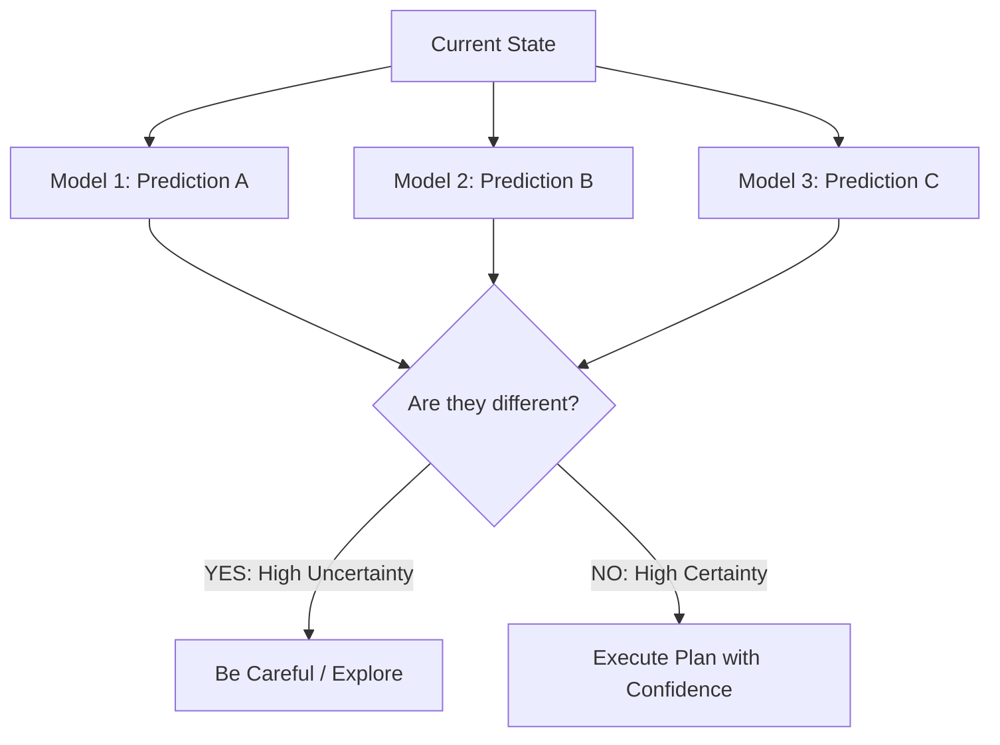

# PETS (Probabilistic Ensembles with Trajectory Sampling)

🧠 **What does this do? (The Analogy)**
Think of a **Doctor consulting a team of 5 Specialists**. 
- One specialist says the patient has a cold. 
- One says it's the flu. 
- Three say they aren't sure. 
Because the specialists **disagree**, the doctor realizes they are in a state of **High Uncertainty**. They decide to run more tests instead of performing surgery. **PETS** is an AI that uses an "Ensemble" of 5-10 models. It only makes a move if all its internal models agree. If they disagree, it knows it's in a dangerous or new situation and it slows down.

🔍 **Step-by-Step Explanation:**
1. **The Ensemble**: Training 5-10 different neural networks to learn the same world model.
2. **Probabilistic Predictions**: Each network doesn't just guess a number; it guesses a **Mean and Variance** (Gaussian).
3. **Trajectory Sampling**: When planning (using MPC), the AI "samples" a different model from the ensemble at every step. This captures both "World Noise" and "Agent Ignorance."
4. **Benefit**: It prevents the "Model Bias" problem where a single AI "imagines" a shortcut that doesn't actually exist in the real world.

📊 **High-Level Design (HLD)**

✅ **Why use this?**
It is one of the most **Sample-Efficient** algorithms in history. It can learn to control a complex robot (like a 7-joint arm) in just **10 minutes** of real-world experience, whereas other algorithms might take 10 hours.

🌍 **Real-World Examples:**
1. **Experimental Engine Tuning**: Optimizing a new jet engine design where you can't afford to make a mistake that causes an explosion.
2. **Medical Dosage Optimization**: Finding the right medicine level by only increasing it when the "Ensemble" is 100% sure it's safe.
