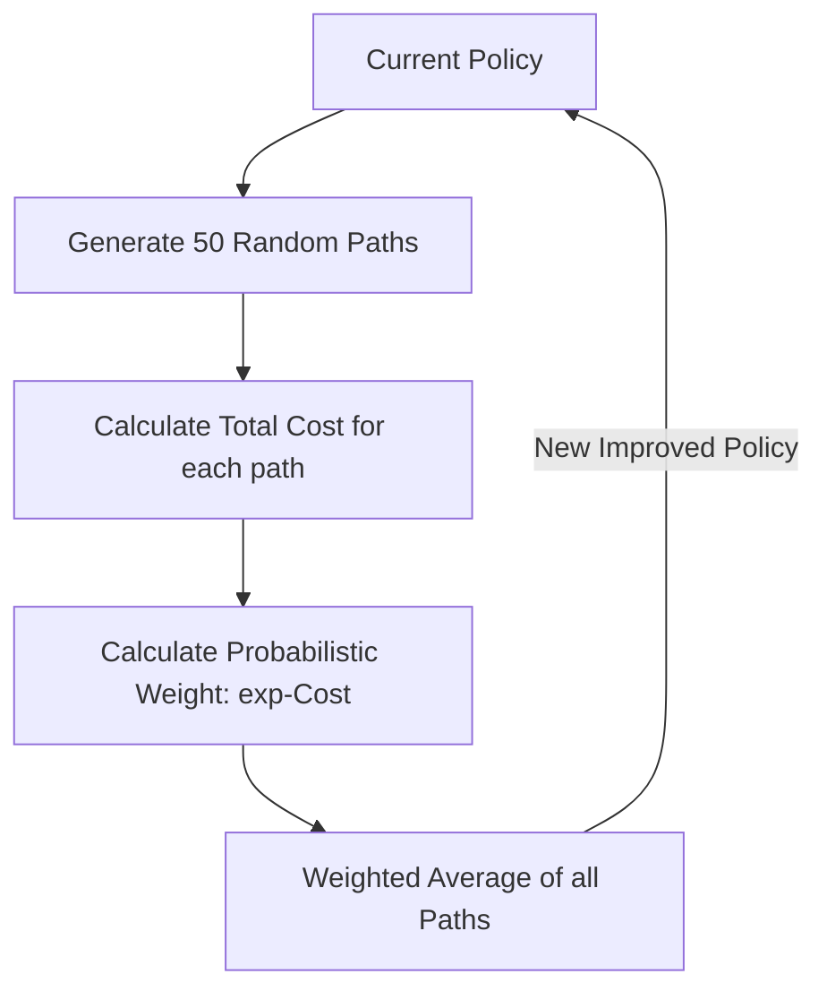

# PI² (Policy Improvement with Path Integrals)

🧠 **What does this do? (The Analogy)**
Think of a **Maze with 100 mice**. All mice start at the entrance and run randomly. Most mice get lost or take a long time, but 5 mice find a very fast path. **PI²** is like a "Super-Intelligence" that watches all 100 mice. It takes the paths of the 5 successful mice and "blends" them together to create a **Perfect Path**. It ignores the mice that failed. It doesn't need to know the "Rules" of the maze—it only needs to see which paths resulted in the lowest "Cost."

🔍 **Step-by-Step Explanation:**
1. **No Gradients**: Unlike PPO or DDPG, PI² doesn't use "Derivatives." It is a "Black Box" optimizer.
2. **Path Integrals**: It treats the RL problem as a statistical physics problem.
3. **Soft-Max Weighting**: The weight of a path is $e^{-Cost}$. This means that a slightly better path gets **much** more influence than a bad one.
4. **Benefit**: It is incredibly stable for high-dimensional robots (like a hand with 20 fingers) because it doesn't get confused by complex math; it only cares about the final result.

📊 **High-Level Design (HLD)**

✅ **Why use this?**
It is one of the most successful algorithms for **Robot Arm Manipulation**. If you want a robot to learn to "Flip a Pancake" or "Pour Water," PI² is often the fastest and most reliable method.

🌍 **Real-World Examples:**
1. **Dynamic Hitting (Table Tennis)**: A robot learning the complex arm movements to hit a ping-pong ball back across a table.
2. **Variable Impedance Control**: Learning how "Soft" or "Stiff" a robot's arm should be when interacting with a human.
