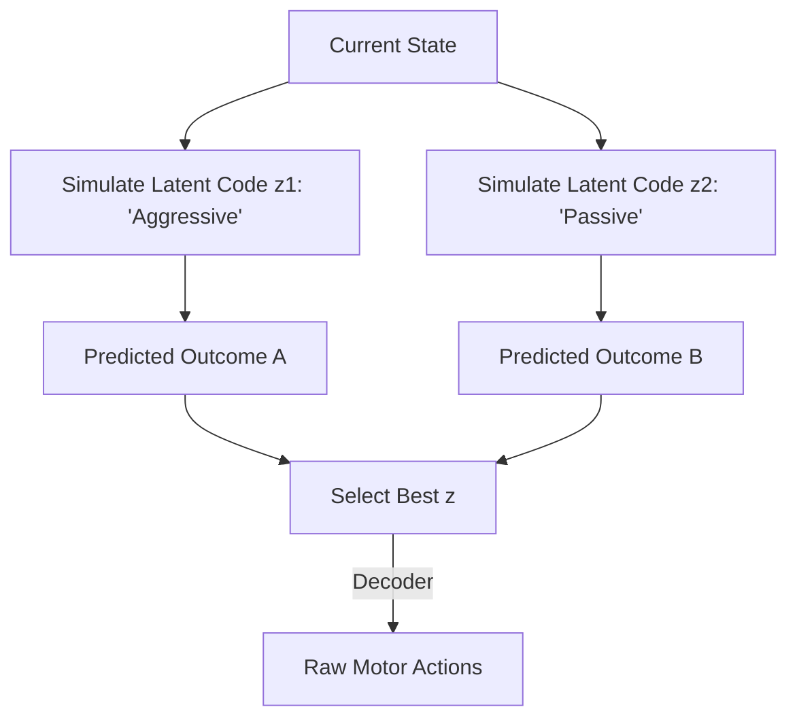

# POPLIN (Policy Planning in Latent Space)

🧠 **What does this do? (The Analogy)**
Think of a **Soccer Coach drawing a play on a whiteboard**. 
- They don't draw every individual step of every player. 
- They draw **Behaviors** (Arrows like "Run Left" or "Pass Here"). 
- **POPLIN** is an AI that plans in "Behaviors" (Latent Space) rather than raw movements. 
By planning with "High-level ideas," the AI can see much further into the future than if it were trying to simulate every tiny muscle movement.

🔍 **Step-by-Step Explanation:**
1. **The Latent Action $z$**: A neural network learns to map complex sequences of raw actions into a single "Code" ($z$).
2. **Latent Dynamics**: A world model learns to predict how the state changes when a specific "Code" (Behavior) is executed.
3. **Planning**: During a game, the AI uses MPC to find the best "Code" $z$ to reach the goal.
4. **Decoding**: Once the best $z$ is found, a "Policy" turns that code back into real-world movements.

📊 **High-Level Design (HLD)**

✅ **Why use this?**
It is the best choice for **High-Dimensional Control**. If you have a robot with 100 sensors, raw planning is too slow. POPLIN "Compresses" the complexity so the AI can think fast and act smart.

🌍 **Real-World Examples:**
1. **Humanoid Walk Planning**: Planning "Steps" (Latent Actions) instead of individual "Joint Torques."
2. **Autonomous Logistics**: Planning "Delivery Routes" (Latent) instead of "Steering Angles" (Raw).
