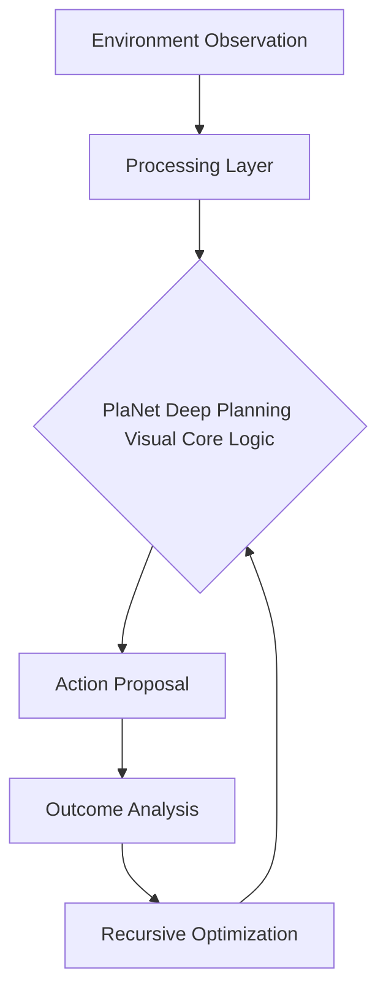

# PlaNet Deep Planning Visual

## 🧠 The Analogy
**A pilot who practices in a flight simulator made of 'Mist' (Latent Space) before flying a real plane.**

## 🚀 Overview
PlaNet learns a latent dynamics model from pixels and uses it for planning with MPC.

## 🔍 Key Concepts
1. **Optimization**: Maximizing long-term reward through specific architectural choices.
2. **Stability**: Ensuring the agent doesn't 'forget' or 'diverge' during training.
3. **Efficiency**: Reducing the number of samples needed to reach expert performance.

## 📊 High-Level Design (HLD)

## ⚖️ Pros and Cons
| Pros | Cons |
| :--- | :--- |
| Sample efficient, visual understanding | Model error can lead to poor planning |

---
*Created for the Reinforcement Learning Encyclopedia Project.*
