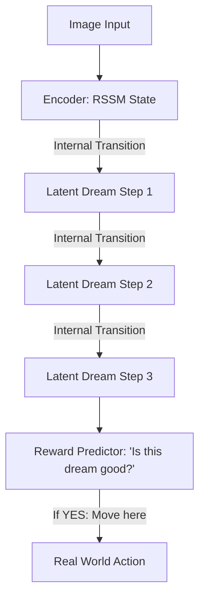

# PlaNet (Deep Planning Network)

🧠 **What does this do? (The Analogy)**
Think of a **Person playing a video game with their eyes closed for 5 seconds**. 
- They saw the screen (The Image), they remember where the hero was, and they know what buttons they are pressing. 
- In their "Mind's Eye" (Latent Space), they can "see" the hero moving even without the screen. 
- **PlaNet** is an AI that learns to "Visualize" the future. It turns complex images into simple "Latent Numbers" and uses those numbers to **Plan** its moves 50 steps ahead without ever needing to look at the real world during the planning phase.

🔍 **Step-by-Step Explanation:**
1. **RSSM (Recurrent State Space Model)**: A neural network that predicts how a "Hidden State" changes over time.
2. **Latent Planning**: Instead of imagining pixels (which is hard), it imagines "Concepts" (which is easy).
3. **MPC (Model Predictive Control)**: Every time the AI acts, it "Dreams" 100 different futures, picks the best one, and takes the first step.
4. **Benefit**: It is **Incredibly Efficient**. It can learn to solve complex tasks (like balancing a pole or driving a car) using **50x less data** than a standard AI.

📊 **High-Level Design (HLD)**

✅ **Why use this?**
It is the best choice for **Visual Control with Limited Data**. If you have a robot with a camera and you can only afford to run it for 1 hour, PlaNet is the architecture that will extract the most intelligence from that 1 hour.

🌍 **Real-World Examples:**
1. **Autonomous Car Parking**: Dreaming about the path into a tight spot to ensure it doesn't hit the curb.
2. **Industrial Sorting**: Predicting where a moving part on a conveyor belt will be in 2 seconds to grab it perfectly.
3. **Game AI**: Playing a game by "Dreaming" about the hidden states of the map that it can't see yet.
