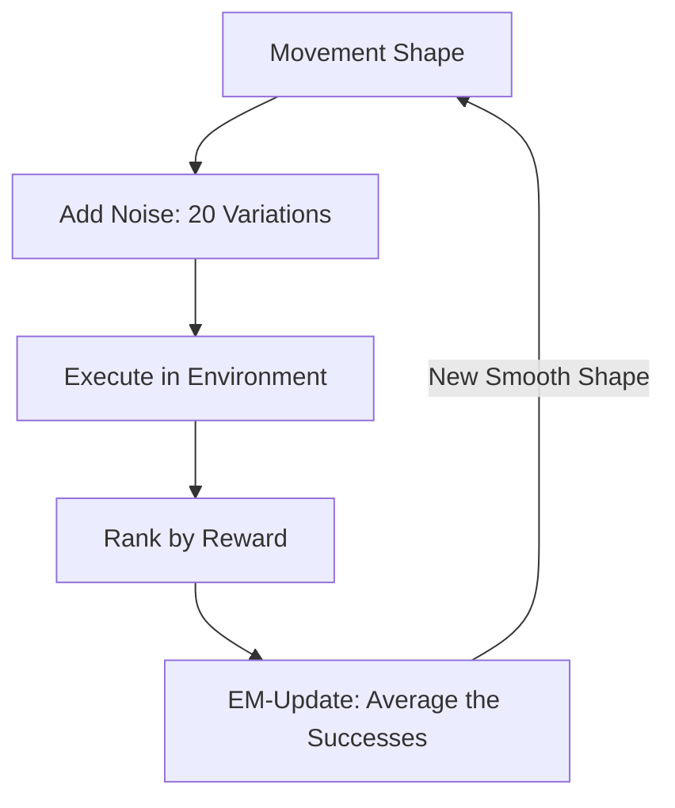

# PoWER (Policy Learning by Weighting Exploration with the Returns)

🧠 **What does this do? (The Analogy)**
Think of a **Darts Player**. 
1. They throw 10 darts. 
2. Some hit the bulls-eye, some miss the board. 
3. **PoWER** tells the player: "Don't try to calculate the physics of your arm. Just look at the 3 darts that hit the bulls-eye and **Copy the feeling** of those specific throws." 
It uses an **EM (Expectation-Maximization)** approach, which is a way of "Guessing" the best parameters by focusing on the examples that worked.

🔍 **Step-by-Step Explanation:**
1. **DMP Integration**: PoWER is almost always used with **Dynamic Movement Primitives (DMPs)**—mathematical "Shapes" of movement.
2. **Exploration**: The agent adds random noise to the movement shape.
3. **Weighting**: It calculates the "Probability of Success" for each noisy throw.
4. **Maximization**: It updates the base shape to be more like the successful noisy throws.
5. **Benefit**: Unlike Policy Gradient, it doesn't need a "Learning Rate" ($alpha$), which makes it much easier to use.

📊 **High-Level Design (HLD)**

✅ **Why use this?**
It is one of the most stable ways to learn **Motor Skills**. If you want a robot to learn to "Swing a Bat" or "Throw a Ball," PoWER is a very powerful choice because it naturally finds smooth, natural-looking movements.

🌍 **Real-World Examples:**
1. **Robotic Ball-in-a-Cup**: A classic benchmark where a robot learns the extremely difficult "Swing and Catch" movement in under 100 attempts.
2. **Industrial Gluing**: A robot learning the precise movement path to apply glue to a complex 3D object.
