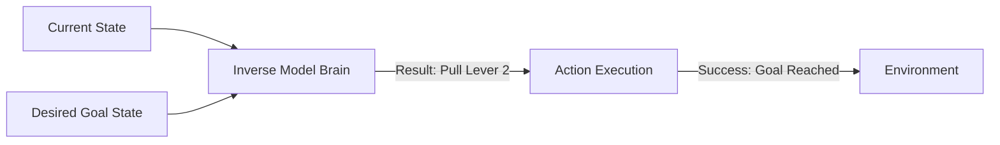

# SIMP (Simple Inverse Model Planning)

🧠 **What does this do? (The Analogy)**
Think of a **Detective investigating a crime scene**. 
- A forward model (Standard) asks: "If I shoot a gun, where will the bullet go?" 
- An **Inverse Model** (SIMP) asks: "The bullet is in the wall. **Where was the shooter standing?**" 
By learning to connect "State Changes" back to "Actions," the AI develops a deep understanding of its own power. It learns exactly which "Levers" it needs to pull to reach a specific destination.

🔍 **Step-by-Step Explanation:**
1. **The Inverse Model**: A neural network that takes $(s_t, s_{t+1})$ and predicts $a_t$.
2. **Action Bottleneck**: Because the AI has to guess the action, it learns to ignore anything in the image that it **cannot control** (like clouds or moving background cars).
3. **Goal-Conditioned Planning**: To reach a Goal State, the AI just asks the Inverse Model: "What action connects my current state to that goal state?"
4. **Benefit**: It is much easier to train than a forward model because "The past is certain, but the future is branching."

📊 **High-Level Design (HLD)**

✅ **Why use this?**
It is the foundation of **Self-Supervised Robotics**. It allows a robot to "play" with objects and learn their physics by observing: "When the block moved left, it was because I pushed it left."

🌍 **Real-World Examples:**
1. **Robotic Hand Manipulation**: Learning how to rotate a pen by observing the relationship between finger movements and pen rotation.
2. **Autonomous Drones**: Learning how the propellers affect the pitch and yaw by observing the resulting changes in the IMU sensors.
