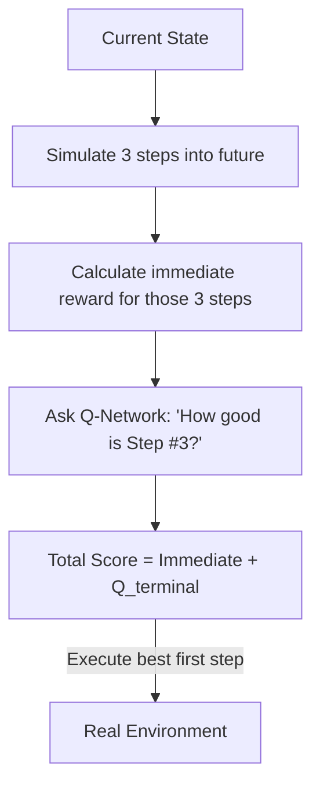

# TD-MPC (Temporal Difference Model Predictive Control)

🧠 **What does this do? (The Analogy)**
Think of a **Road Trip**. 
- Standard MPC is like a driver who only has a map for the next **5 miles**. They drive perfectly for those 5 miles, but then they have no idea if they are headed toward a cliff or a city. 
- **TD-MPC** is a driver who has a map for the next 5 miles, AND a **GPS** that tells them the "Estimated Time to Destination" for the rest of the 500-mile trip. 
By combining **Short-term Planning** (the map) with **Long-term Value Estimation** (the GPS), the AI can make perfect split-second decisions while always moving toward the ultimate goal.

🔍 **Step-by-Step Explanation:**
1. **The Model**: A world model that predicts the next 3-5 steps very accurately.
2. **The Terminal Value ($Q$)**: A neural network that estimates the total reward from the 5th step all the way to the end of the game.
3. **Planning**: During the simulation, the AI picks the action that maximizes $[ \text{Reward for steps 1-5} + Q(\text{Step 5}) ]$.
4. **Benefit**: It is 10x faster to train than standard MPC because it doesn't need to simulate a long path to see the goal. It only needs to "reach" the area that the Q-network already knows is good.

📊 **High-Level Design (HLD)**

✅ **Why use this?**
It is the current **SOTA for Sample Efficiency**. It can solve complex robotic tasks (like a dog running on uneven terrain) in just **30 minutes** of real-world experience.

🌍 **Real-World Examples:**
1. **Agile Drone Racing**: Planning the immediate turn through a hoop while using a Q-value to ensure the drone is in the right position for the *next* hoop.
2. **Humanoid Robot Jogging**: Planning the foot placement for the next 2 steps while using a value function to stay balanced for the next 2 minutes.
