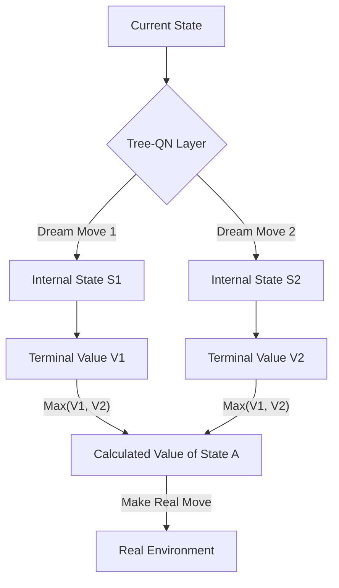

# Tree-QN (Learned Tree Search)

🧠 **What does this do? (The Analogy)**
Think of a **Person standing at a crossroad**. 
- A normal RL (DQN) looks at the road and says: "This road looks like it leads to a city." 
- **Tree-QN** says: "I will walk 100 meters down this road, look around, then walk another 100 meters, and only **then** will I decide if this road is good." 
It incorporates a **Search Tree** directly into the neural network's brain. It doesn't just "guess" the value of a state; it "simulates" the next 3-4 moves to **calculate** the value.

🔍 **Step-by-Step Explanation:**
1. **The Model**: The neural network includes a small "Dynamics Model" that predicts what happens next.
2. **Expansion**: When the AI sees a state, it "Expands" a tree of depth $K$ in its head.
3. **Value Backpropagation**: It calculates the value of the "Leaves" of the tree and pulls that value back to the "Root."
4. **Benefit**: It is more **Accurate** than a standard Q-network because it uses the "Structure" of the world to help its math.

📊 **High-Level Design (HLD)**

✅ **Why use this?**
It is the best choice for **Complex Navigation**. If you have a robot in a maze, "guessing" the value of a hallway is hard. "Simulating" walking down the hallway is easy. Tree-QN gives you the best of both worlds.

🌍 **Real-World Examples:**
1. **Autonomous Forklifts**: Simulating the next 3 seconds of movement to ensure they don't hit a shelf before they actually move.
2. **Network Traffic Routing**: Planning the "Path" of a packet by simulating the next 3 nodes in the network.
