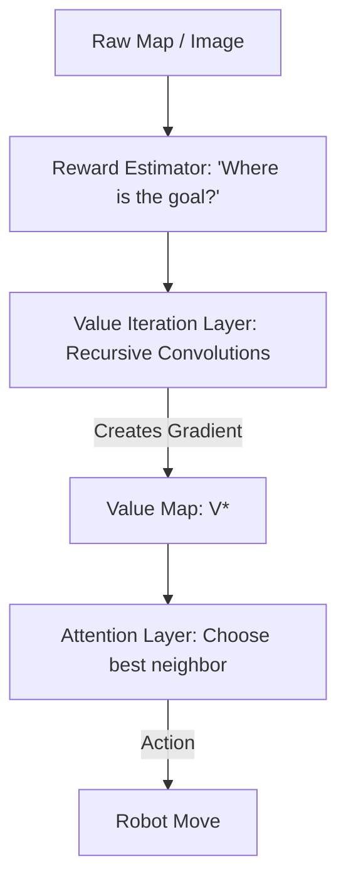

# Value Iteration Networks (VIN)

🧠 **What does this do? (The Analogy)**
Think of a **Puddle of Water expanding on a floor**. 
- The goal is a "Drain" (High Reward). 
- If you pour water anywhere on the floor, it will eventually find the drain. 
- **VIN** is an AI that plans by "Simulating a Puddle" in its head. 
- It treats the map like an image and uses a **Convolution** (a mathematical filter) to "spread" the value of the goal to all the neighboring squares. By doing this 10 times, the AI creates a "Gradient" that shows it exactly how to walk to the goal from any position on the map.

🔍 **Step-by-Step Explanation:**
1. **Planning as Convolution**: VIN realizes that "Value Iteration" (checking neighbors) is mathematically the same as a 2D convolution in image processing.
2. **Internal Planner**: The neural network has a "Planning Layer" inside it that runs this convolution multiple times.
3. **Reactive Policy**: Once the "Value Map" is created, the AI just takes one step toward the highest neighbor.
4. **Benefit**: It can generalize to **New Maps**. If you train a VIN on 1,000 different mazes, it will be able to solve a 1,001st maze instantly because it has learned the "Concept" of planning, not just a specific path.

📊 **High-Level Design (HLD)**

✅ **Why use this?**
It is the best choice for **Navigation and Spatial Logic**. If your robot needs to find its way through a house or a warehouse, VIN allows it to "think ahead" spatially like a human looking at a map.

🌍 **Real-World Examples:**
1. **Warehouse Logistics**: A robot that can find the fastest path between any two shelves even if the warehouse layout changes every day.
2. **Strategy Game AI**: An AI that plans its "Battle Front" by looking at the terrain and "spreading" the value of strategic high ground.
