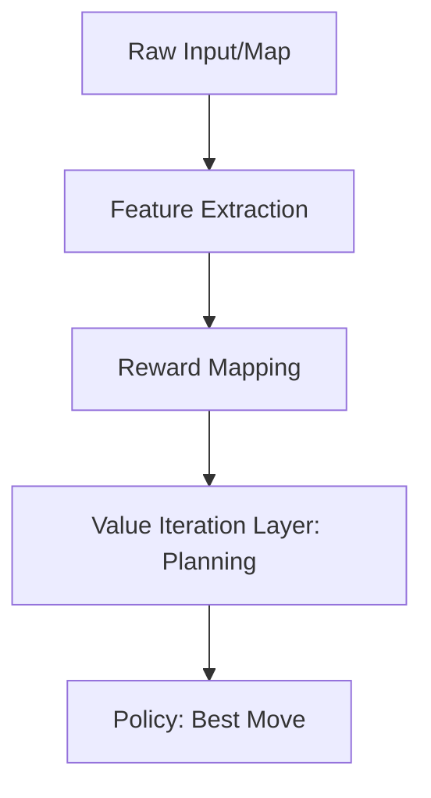

# Value Iteration Networks (VIN)

🧠 **What does this do? (The Analogy)**
Think of a **Maze Solver** who has the map in their head. Standard RL learns a "Reaction" (If I see a wall, turn left). **VIN** learns a "Planning Process." It's like having a small **mini-simulation** inside the brain that runs 10 steps ahead to find the exit before the agent even takes the first step. The network doesn't just learn *what* to do; it learns *how to plan*.

🔍 **Step-by-Step Explanation:**
1. **The Problem**: Standard CNNs (Convolutional Neural Networks) are great at recognizing objects but terrible at planning long-term paths.
2. **The VI Layer**: VIN adds a special layer that performs **Value Iteration** (Bellman Updates) as if it were a series of convolutions.
3. **Internal Simulation**: The network creates a "Virtual Map" of the environment and "runs" a planning algorithm on it.
4. **Generalization**: Because the agent learns the *concept* of planning, you can put it in a brand-new maze, and it will "figure out" the exit immediately without needing to re-learn.

📊 **High-Level Design (HLD)**

✅ **Why use this?**
It is perfect for **Navigation Tasks**. It allows agents to solve complex "find-the-path" problems with much less data because the architecture itself is built to understand geometry and planning.

🌍 **Real-World Examples:**
1. **Warehouse Robotics**: A robot that can navigate any warehouse layout it's dropped into because it understands the *logic* of pathfinding.
2. **Video Games (Strategy)**: An AI in a game like Civilization or StarCraft that can plan multi-step movements across unknown maps.
