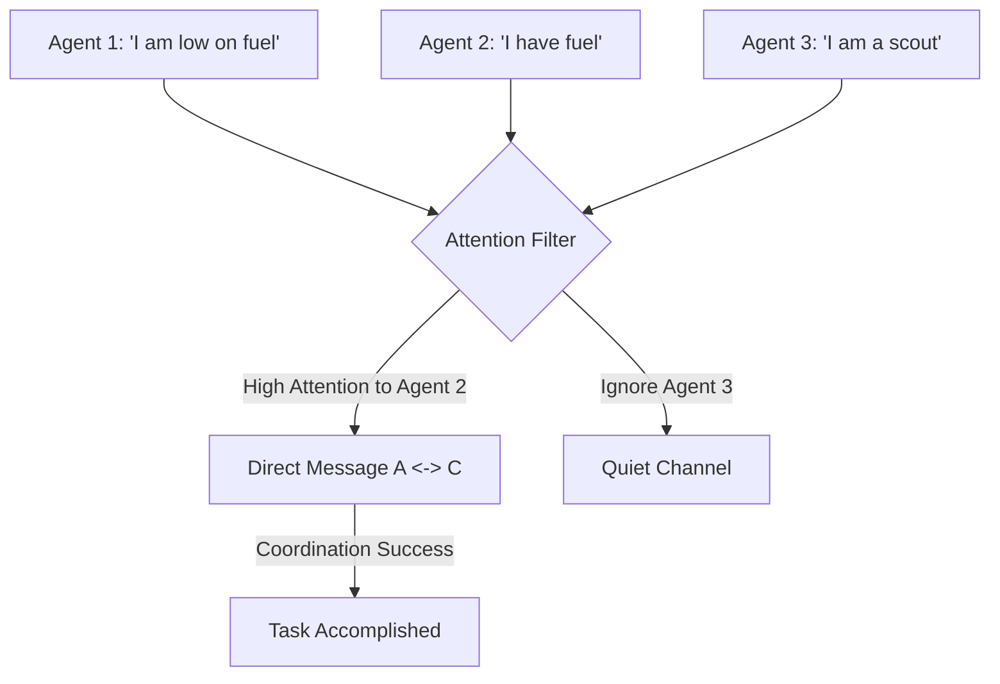

# ATOC (Attention-based Communication)

🧠 **What does this do? (The Analogy)**
Think of a **Busy Restaurant Kitchen**. 
- 20 chefs are working. If everyone screams everything they are doing (Full Communication), nobody can hear anything and everyone gets confused. 
- **ATOC** is the "Sous Chef" who only talks to the people **relevant** to their specific dish. 
- If the Pastry Chef is making a cake, they "Attend" to the Oven person, but they ignore the person cutting onions. 
By only talking to the right people at the right time, the team coordinates perfectly without "Information Overload."

🔍 **Step-by-Step Explanation:**
1. **Dynamic Messaging**: Agents don't have a fixed radio channel. They decide who to talk to in real-time.
2. **Attention Mechanism**: The agent looks at the "Tags" of all its teammates and calculates an "Attention Score."
3. **Information Bottleneck**: Only the most relevant information is sent, saving bandwidth and reducing noise.
4. **Benefit**: It allows for **Scaling**. You can have 1,000 agents in a forest, and each one only "hears" the 5 agents closest to them that are actually affecting their survival.

📊 **High-Level Design (HLD)**

✅ **Why use this?**
It is the best choice for **Large-Scale Swarms**. If you are managing 10,000 delivery drones in a city, you can't have them all talking to each other. ATOC allows them to "cluster" and communicate locally and intelligently.

🌍 **Real-World Examples:**
1. **Traffic Light Networks**: A traffic light only "communicates" with the 4 traffic lights immediately surrounding it, ignoring the ones 5 miles away.
2. **Multi-Robot Search & Rescue**: Robots "attending" to the teammate that just found a survivor, while others continue their search silently.
