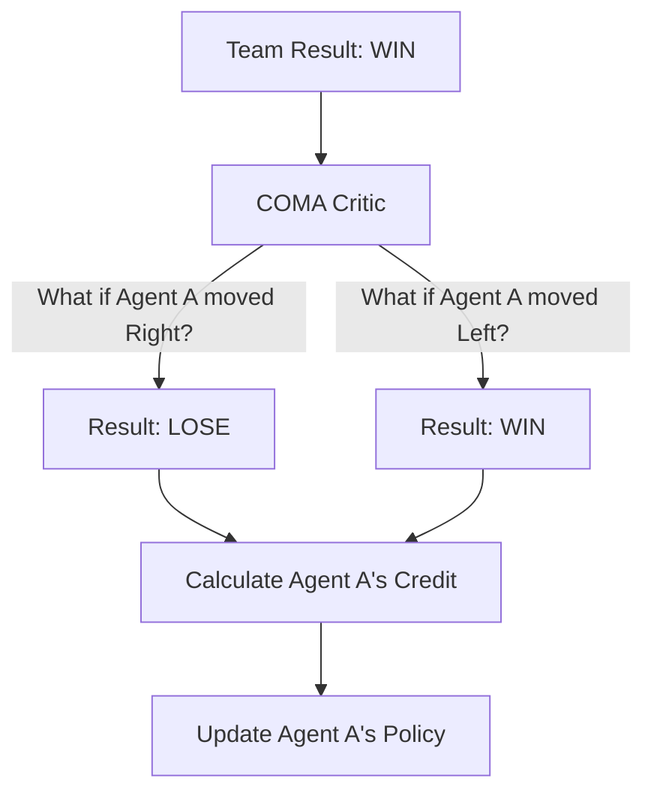

# COMA (Counterfactual Multi-Agent)

🧠 **What does this do? (The Analogy)**
Think of a **Tug-of-War Team**. If the team wins, everyone gets a trophy. But how do you know who was actually pulling and who was just holding the rope? **COMA** is like a "Ghost Simulation." It looks at the team's victory and asks: "What would have happened if **Agent #3** had let go of the rope?" If the team still won, Agent #3 gets zero credit. If the team lost, Agent #3 gets **Massive Credit** for being the reason they won. It is the "What-If" engine for credit assignment.

🔍 **Step-by-Step Explanation:**
1. **The Credit Problem**: In teams, individual contribution is hard to measure from a single "Team Score."
2. **Counterfactual Baseline**: COMA calculates a "Baseline" for each agent by averaging the team's Q-values across all possible actions that agent *could* have taken.
3. **Advantage**: The agent's reward is the **Difference** between what actually happened and the average of what could have happened.
4. **Benefit**: This forces every agent to be "Individually Responsible." It prevents "Lazy Agents" who just hide behind their teammates' success.

📊 **High-Level Design (HLD)**

✅ **Why use this?**
It is the standard for **StarCraft II** and other complex strategy games where you have 50 units (agents) and only one "Victory" signal at the end. It ensures that every unit learns its specific "Role" perfectly.

🌍 **Real-World Examples:**
1. **Multi-Robot Firefighting**: Determining which robot was the most important in putting out a fire based on their positions.
2. **Financial Trading Teams**: Calculating which individual stock-picking bot contributed the most to a portfolio's profit while accounting for the market's "average" performance.
