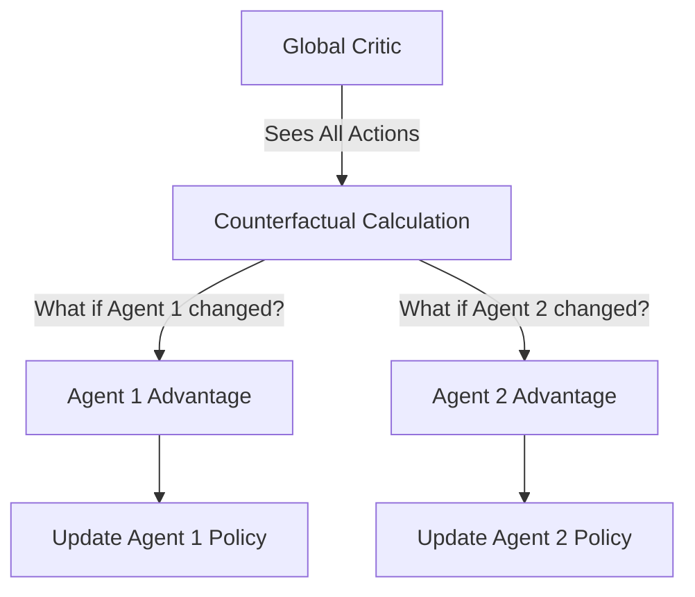

# COMA (Counterfactual Multi-Agent)

🧠 **What does this do? (The Analogy)**
Think of a **Company Bonus**. The whole company gets a $10,000 bonus if the project succeeds. But how do you decide how much to give to **one specific employee**? **COMA** uses "Counterfactual" thinking. It asks: "If this employee had done a *different* job, but everyone else stayed the same, would the project still have succeeded?" By comparing the actual result with this "Imaginary Alternative," the AI can perfectly calculate the **Contribution** (Credit Assignment) of every single team member.

🔍 **Step-by-Step Explanation:**
1. **The Problem**: In a team of 10, if 1 person works hard and 9 are lazy, but the team still wins, standard RL rewards everyone equally. This is the "Lazy Agent" problem.
2. **The Counterfactual Baseline**: COMA calculates an "Average Team Reward" by looking at all actions the agent *could* have taken.
3. **The Advantage**: The agent only gets a positive update if its **actual action** was better than its "Average" behavior.
4. **Centralized Critic**: One critic sees everyone's actions to calculate these counterfactuals, while each agent has its own local policy.

📊 **High-Level Design (HLD)**

✅ **Why use this?**
It is the ultimate solution for **Team Incentives**. It prevents "Freeloaders" in multi-agent systems because every agent knows that its reward depends strictly on its *individual* contribution to the group goal.

🌍 **Real-World Examples:**
1. **Ride-Sharing Hubs**: Coordinating a fleet of taxis where a "Team Reward" is total city coverage, but each driver is rewarded based on how their specific position improved the overall wait time.
2. **Cooperative Gaming (Healers vs. Damage)**: Training a "Healer" bot in a game to understand that even though it didn't "Kill" any enemies, its healing was the only reason the team survived (Counterfactual: "If I hadn't healed, we would have lost").
