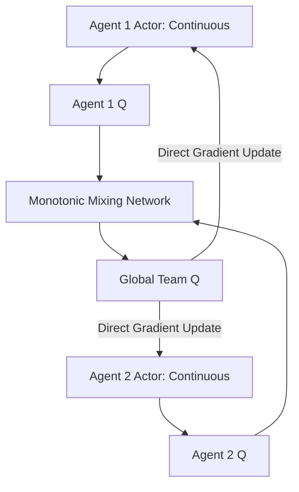

# FACMAC (Factored Multi-Agent Continuous)

🧠 **What does this do? (The Analogy)**
Think of a **Symphony Orchestra**. Every musician plays a continuous range of notes (Actions). Standard multi-agent systems are great at "Yes/No" choices, but they struggle with "How much?" **FACMAC** is like a **Conductor** who manages a continuous team. It combines the "Teamwork Logic" of QMIX with the "Smooth Control" of DDPG. It ensures that if the Violinist plays slightly more beautifully, the *overall* symphony sounds better, even if the music is incredibly complex and continuous.

🔍 **Step-by-Step Explanation:**
1. **The Architecture**: It is the continuous version of QMIX.
2. **Actor-Critic**: Each agent has its own Actor (to decide "How much?") and its own Critic.
3. **Monotonic Mixer**: Just like QMIX, it uses a mixing network with positive weights to combine individual values into a global team value.
4. **Gradient Flow**: Because it uses the "Deterministic Policy Gradient" (DDPG logic), it can handle tasks like driving, flying, or motor torque that need precise numbers, not just "Left/Right" choices.

📊 **High-Level Design (HLD)**

✅ **Why use this?**
It is the current best way to coordinate **Teams of Robots** that need to do physical work together. Standard QMIX only works for discrete choices (like in StarCraft); FACMAC works for the real physical world.

🌍 **Real-World Examples:**
1. **Autonomous Platoon**: A fleet of 10 self-driving trucks following each other closely on a highway—they need continuous control of their speed and steering to save fuel and stay safe as a team.
2. **Precision Manufacturing**: Multiple robotic arms holding a single large airplane wing while it is being drilled—they must coordinate their continuous motor torques perfectly to avoid bending the wing.
