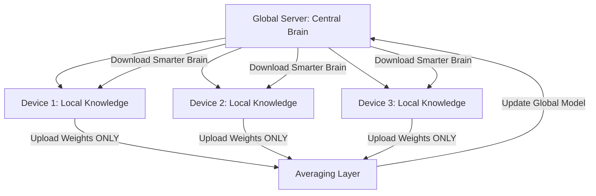

# Federated Reinforcement Learning (Privacy RL)

🧠 **What does this do? (The Analogy)**
Think of a **Secret League of Doctors**. Each doctor has their own patients. For privacy reasons, the doctors cannot share their patients' names or medical history (**Data Privacy**). However, they want to learn together to find a cure. **Federated RL** is a system where each doctor trains their own "Small AI" locally. They then send only the **AI's Knowledge** (the weights) to a central meeting. The central meeting "Averages" the knowledge and sends a new, "Smarter AI" back to every doctor. No private data ever leaves the clinic.

🔍 **Step-by-Step Explanation:**
1. **Local Training**: Each device (Phone, Hospital, Car) trains its own RL agent on its own local data.
2. **Knowledge Upload**: The devices send their **Model Weights** to a central server. They **DO NOT** send any raw data.
3. **Aggregation**: The server calculates the average of all these weights: $W_{global} = \frac{1}{N} \sum W_{local}$.
4. **Synchronization**: The new "Global Brain" is sent back to all devices.
5. **Benefit**: The AI gets the experience of millions of users without ever violating their privacy.

📊 **High-Level Design (HLD)**

✅ **Why use this?**
It is the future of **Privacy-First AI**. Whether it is smart keyboards learning your typing style or self-driving cars learning from different cities, Federated RL allows companies to build massive intelligence without ever looking at your private information.

🌍 **Real-World Examples:**
1. **Smart Keyboards (Gboard)**: Learning which words you often use together across millions of phones without Google ever reading your private texts.
2. **Autonomous Fleets**: A fleet of 1,000 self-driving cars learning from "Near Misses" across different cities. The cars share the *lesson* but not the *video* of where they were.
