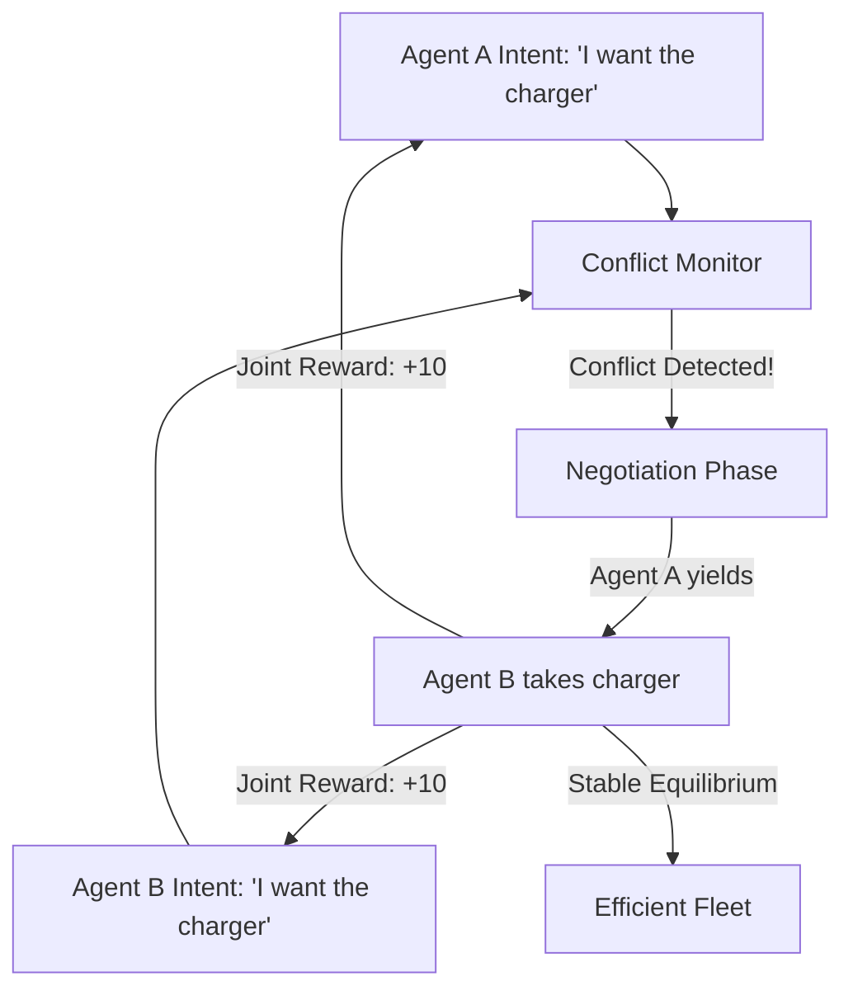

# IC3 (Interactive Conflict & Coordination)

🧠 **What does this do? (The Analogy)**
Think of a **Narrow Bridge with two people walking toward each other**. 
- If both keep walking, they crash and fall (Conflict). 
- If both wait forever, neither gets home (Stall). 
- **IC3** is the logic that allows them to "Negotiate" without speaking. 
- One person takes a small step to the side (Signaling), and the other person speeds up (Taking the Lead). 
**IC3** is an AI that learns how to handle "Overlapping Interests." It recognizes when it is "in the way" of another AI and learns how to yield or dominate to maximize the **team's** total success.

🔍 **Step-by-Step Explanation:**
1. **Interactive Policy**: The agent's actions are conditioned on the *intent* of the other agents.
2. **Conflict Detection**: The AI recognizes "States" where two agents are competing for a single resource (e.g., a physical location or a communication channel).
3. **Implicit Negotiation**: The agents learn a "Dance" where they take turns.
4. **Benefit**: It solves the "Frozen Robot" problem where multiple robots in a hallway get stuck because they all try to be "too safe" or "too aggressive."

📊 **High-Level Design (HLD)**

✅ **Why use this?**
It is the best choice for **Crowded Multi-Agent Environments**. If you have 50 robots in a small warehouse, IC3 is the only way to keep them moving smoothly without "gridlocking."

🌍 **Real-World Examples:**
1. **Autonomous Intersection Management**: Cars that "negotiate" who goes first through a 4-way stop without needing a traffic light.
2. **Surgical Robots**: Multiple robotic arms working in a tiny space inside a patient's body, "coordinating" their movements to never collide.
