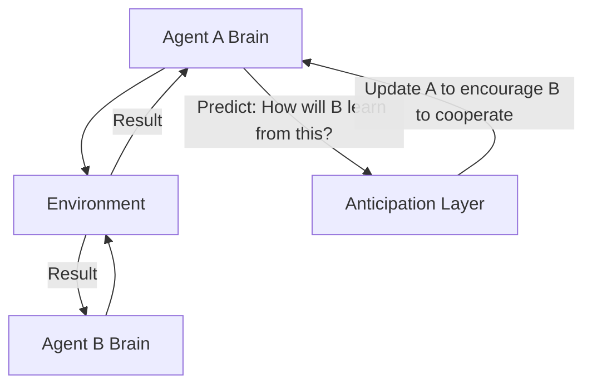

# LOLA (Learning with Opponent-Learning Awareness)

🧠 **What does this do? (The Analogy)**
Think of a **Negotiation between two business partners**. 
- Standard RL (Naive) is like a partner who only thinks about their own profit today. 
- **LOLA** is like a partner who thinks: "If I am greedy today, my partner will **learn** that I am untrustworthy and they will stop working with me tomorrow. Therefore, I will be fair today to **encourage** my partner to keep working with me." 
It is "Second-Order Thinking." The AI realizes that its own actions change how **others** learn, and it uses this to create stable cooperation.

🔍 **Step-by-Step Explanation:**
1. **The Opponent's Brain**: The agent maintains a model of how the other agent updates its weights.
2. **Gradient-of-Gradients**: When calculating its own update, the agent includes the "derivative" of the other agent's future behavior.
3. **Influence**: The agent chooses actions that "Shape" the opponent's learning toward a win-win scenario.
4. **Benefit**: It solves the "Prisoner's Dilemma" and other games where standard AI usually becomes selfish and ruins the team.

📊 **High-Level Design (HLD)**

✅ **Why use this?**
It is the gold standard for **Cooperative-Competitive Games**. It is the only algorithm that consistently finds "The Handshake" (Cooperation) in games where being selfish is easier in the short term.

🌍 **Real-World Examples:**
1. **Algorithmic Stablecoin Management**: Multiple AIs managing a currency's price, "cooperating" to stay stable because they know "war" would hurt everyone's profit.
2. **Ad Bidding Markets**: AIs that "signal" to each other in an auction to keep prices fair for both the buyer and the seller.
