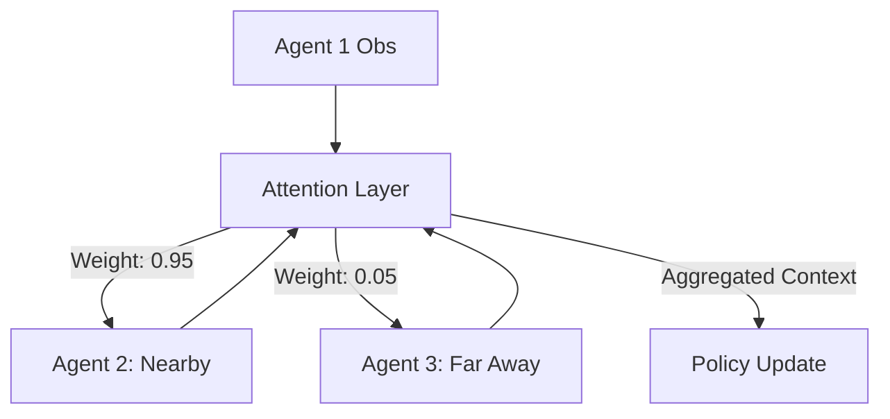

# MAAC (Multi-Agent Attention Actor-Critic)

🧠 **What does this do? (The Analogy)**
Think of a **Cocktail Party**. You are in a room with 20 people talking. Most of the talking is just background noise. But when you hear your **Teammate** shout: "Watch out!", your brain instantly **Attends (Focuses)** on them and ignores everyone else. **MAAC** is an AI that learns which teammates are "Worth Listening To" at any given moment. It doesn't waste energy listening to an agent that is on the other side of the map doing nothing.

🔍 **Step-by-Step Explanation:**
1. **The Query/Key/Value Mechanism**: It uses the same "Self-Attention" logic as GPT-4.
2. **Dynamic Weights**: At every millisecond, the agent calculates an "Importance Score" for every other agent in the team.
3. **Selective Credit**: When it's time to learn, the agent only looks at the "Important" neighbors.
4. **Benefit**: It is much more efficient than MADDPG because it doesn't get overwhelmed by "Noise" from irrelevant agents. It can handle much larger teams.

📊 **High-Level Design (HLD)**

✅ **Why use this?**
It is the best choice for **Sparse Interaction Tasks**. If you have 100 robots in a giant building, most of them won't see each other. MAAC ensures that they only coordinate when they are actually close enough to matter.

🌍 **Real-World Examples:**
1. **Autonomous Air Traffic Control**: Coordinating 50 planes in the sky, where each plane only "attends" to the 2-3 planes that are closest to it.
2. **Social Robot Navigation**: A robot walking through a crowd and "attending" to the people who are walking toward it while ignoring the people walking away.
