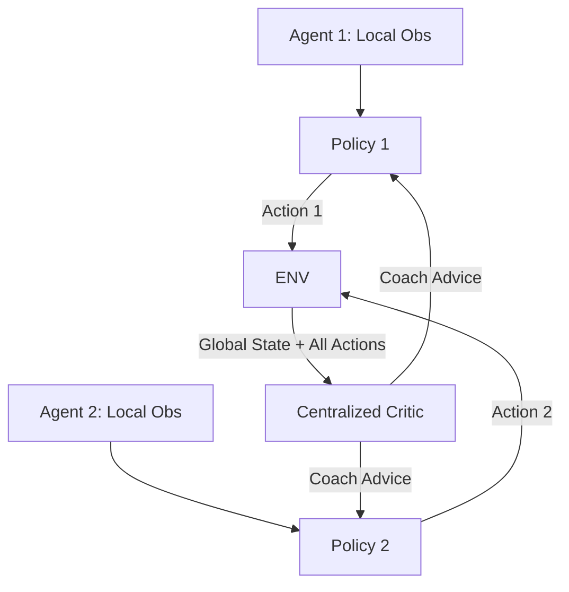

# MADDPG (Multi-Agent DDPG)

🧠 **What does this do? (The Analogy)**
Think of a **Soccer Team**. 
1. **The Game (Execution)**: During the game, each player only sees what is in front of them (Local State). They have to make split-second decisions without knowing exactly what's happening on the other side of the field.
2. **The Film Room (Training)**: After the game, the coach (Centralized Critic) shows the team a video of the whole field. The coach says: "You moved left, but if you had seen that your teammate was open on the right, the team would have scored." 
**MADDPG** allows agents to learn from the "Big Picture" during training so they can act correctly on their own during the game.

🔍 **Step-by-Step Explanation:**
1. **Centralized Training**: The Critic has access to the states and actions of **ALL** agents. This solves the problem of "Non-Stationarity" (where the world changes because other agents are moving).
2. **Decentralized Execution**: The Actor (Policy) only receives its own local observation. It doesn't need to know what others are doing to act.
3. **Continuous Actions**: Like DDPG, it works perfectly for smooth, robotic movements.
4. **Benefit**: It allows for complex cooperation (e.g., "I'll distract the guard while you steal the key") without needing a master computer to control everyone during the mission.

📊 **High-Level Design (HLD)**

✅ **Why use this?**
It is the foundation of **Modern Multi-Agent RL**. If you have a group of robots or drones that need to work together in a forest or a warehouse, MADDPG is the starting point for their coordination.

🌍 **Real-World Examples:**
1. **Drone Swarm Search and Rescue**: 10 drones spreading out to find a missing person, coordinating their search patterns without a central controller.
2. **Autonomous Intersection Management**: Cars at a 4-way stop "negotiating" who goes first based on what they learned during training.
